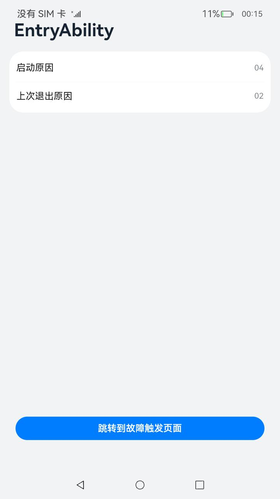
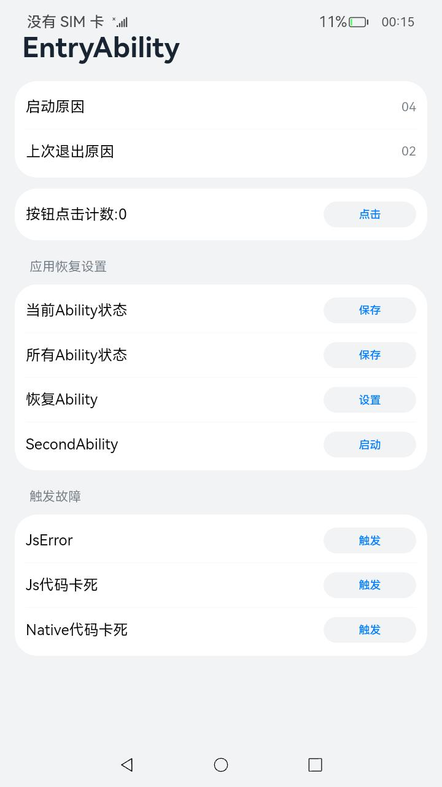

# 应用故障恢复

### 介绍
本示例展示了在应用中如何适配故障恢复相关接口。

样例包含以下场景：\
一.单Ability自动恢复 \
在EntryAbility的故障触发页面触发故障，自动重启回到故障触发页面。

二.多Ability自动恢复 \
应用中启动了EntryAbility和SecondAbility，在第二个启动的SecondAbility的故障触发页面触发故障。 \
自动重启到SecondAbility的故障触发页面。 \
从任务管理中将EntryAbility切回前台，预期能回到故障触发页面，并恢复页面上点击次数信息。

三.多Ability主动恢复 \
应用中启动了EntryAbility和SecondAbility，在第二个启动的SecondAbility的故障触发页面触发故障。 \
重启时启动RecoveryAbility，让使用者选择具体启动的Ability。

四.Ability后台强制终止恢复 \
应用中启动了EntryAbility和SecondAbility，并切入后台。\
系统回收该应用，再次拉起时能够恢复先前的状态。

相关概念： \
故障：指的是应用处于无法提供服务的状态，如卡死以及崩溃。 \
系统强制终止：指的是由于系统或者应用的原因，系统强制终止正在运行的应用进程，并回收资源的操作。

### 效果预览
|首页|故障触发页面|
|---|---|
|||

使用说明

一.单Ability自动恢复 \
点击首页点击``跳转到故障触发页面`` \
在故障触发页面点击按钮``点击``，再点击``保存当前Ability状态``以及``触发JsError``。 \
以上场景预期：\
能够回到``故障触发页面``页面，页面上的点击次数与触发保存状态时的一致。

二.多Ability自动恢复 \
点击首页点击跳转到``故障触发页面`` \
在``故障触发页面``点击``启动SecondAbility``
点击首页点击``跳转到故障触发页面`` \
在故障触发页面点击按钮``点击``，再点击``保存当前Ability状态``以及``触发JsError``。 \
以上场景预期：\
立即回到SecondAbility的故障触发页面，并恢复页面的点击次数信息。\
从任务管理中将EntryAbility切回前台，预期能回到故障触发页面，页面上的点击次数与触发保存状态时的一致。

三.多Ability主动恢复 \
点击首页点击跳转到``故障触发页面`` \
在``故障触发页面``点击``启动SecondAbility``
在SecondAbility的故障触发页面点击设置重启Ability。 \
在SecondAbility的故障触发页面点击``触发JsError``。 \
以上场景预期：\
重启时启动RecoveryAbility。

四.Ability后台强制终止恢复 \
点击首页点击跳转到``故障触发页面`` \
在``故障触发页面``点击``启动SecondAbility``
在SecondAbility的故障触发页面点击Counter，点击``保存当前Ability状态``,并切入后台 \
使用kill命令强制终止当前应用 \
以上场景预期：\
从任务管理中将EntryAbility切回前台，预期能回到故障触发页面，并恢复页面上的点击次数信息。\
从任务管理中将SecondAbility切回前台，预期能回到故障触发页面，并恢复页面上的点击次数信息。

为避免反复拉起，两次测试的间隔至少为60秒(自动拉起的间隔为60秒)。
### 工程目录
```
entry/src/main/
├── cpp                      // 触发Native卡死代码
│   ├── CMakeLists.txt
│   ├── hello.cpp
│   └── types
│       └── libentry
│           ├── index.d.ts
│           └── oh-package.json5
├── ets
│   ├── ability
│   │   ├── EntryAbility.ets  // 测试入口Ability
│   │   ├── RecoveryAbility.ets // 恢复引导Ability
│   │   └── SecondAbility.ets // 测试第二Ability
│   ├── app
│   │   └── MyAbilityStage.ets // 用于初始化appRecovery的配置
│   ├── common
│   │   ├── Logger.ts  // 日志
│   │   └── TitleBar.ets // 标题
│   └── pages
│       ├── FaultTriggerPage.ets // 故障触发页面
│       ├── Index.ets // 首页
│       └── RecoveryPage.ets // 恢复页面
```

### 具体实现
* 使能应用恢复功能，源码参考：[MyAbilityStage.ets](entry/src/main/ets/app/MyAbilityStage.ets)
    * 在``onCreate``中 调用[appRecovery](https://gitee.com/openharmony/docs/blob/master/zh-cn/application-dev/dfx/apprecovery-guidelines.md)接口使能功能
* 配置支持恢复的Ability，源码参考：[module.json5](entry/src/main/module.json5)
    * 在``Ability``的节点中增加``recoverable``的配置，并设置为``true``
* 实现恢复功能，源码参考：[EntryAbility.ets](entry/src/main/ets/ability/EntryAbility.ets)
    * 在``onSaveState``中保存用于恢复的数据
    * 在``onCreate``的``want``参数中恢复所需要的数据

### 相关权限
不涉及

### 依赖
无

### 约束与限制

1.本示例仅支持标准系统上运行，支持设备：RK3568。

2.本示例为Stage模型，支持API10版本SDK，SDK版本号(API Version 10 Release),镜像版本号(4.0 Release)

3.本示例需要使用DevEco Studio 版本号(4.0 Release)及以上版本才可编译运行。

### 下载

给出单独下载本工程的命令，在代码中替换工程目录并以/结尾，如下面示例中的 **code/BasicFeature/DFX/AppRecovery/**，示例如下：

如需单独下载本工程，执行如下命令：

```
git init
git config core.sparsecheckout true
echo code/BasicFeature/DFX/AppRecovery/ > .git/info/sparse-checkout
git remote add origin https://gitee.com/openharmony/applications_app_samples.git
git pull origin master
```
