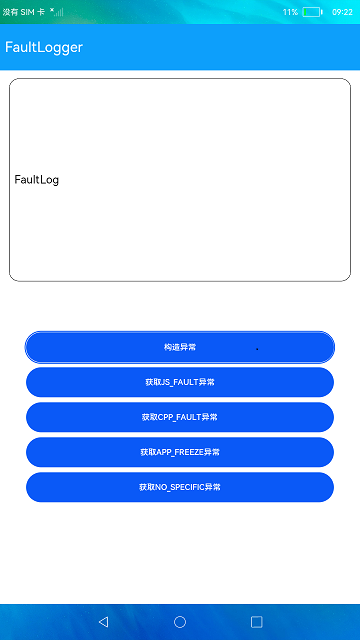

# 故障日志获取

### 介绍

本示例使用了[@ohos.faultLogger](https://docs.openharmony.cn/pages/v4.1/zh-cn/application-dev/reference/apis-performance-analysis-kit/js-apis-faultLogger.md)接口，展示了在eTS中如何获取应用故障相关信息。

### 效果预览
|首页|
|--------|


使用说明：
1. 启动应用后，点击**构造异常**按钮，在弹窗中选择故障类型，点击确定可以构造异常场景;
2. 构造异常场景后，重新启动应用，点击下面不同的获取异常按钮可以获取到对应类型的异常日志并显示在页面文本框中。

### 工程目录
```
entry/src/main/ets/
|---common
|   |---FaultDialog.ets                    // 异常构造弹窗
|   |---TitleBar.ets                       // title
|---model
|   |---Logger                             // 日志工具
|---pages
|   |---Index.ets                          // 首页
```

### 具体实现
+ 创造应用故障场景，故障类型枚举值参考[FaultType](https://docs.openharmony.cn/pages/v4.1/zh-cn/application-dev/reference/apis-performance-analysis-kit/js-apis-faultLogger.md)，源码参考[FaultDialog.ets](entry/src/main/ets/common/FaultDialog.ets)：
    + js_crash故障：通过数组访问越界构造;
    + cpp_crash故障：通过调用不存在的Api接口构造;
    + freeze_crash故障：通过代码产生死循环构造;
+ 获取上述异常故障日志,源码参考[Index.ets](entry/src/main/ets/pages/Index.ets)：
    + 获取异常故障日志：使用faultLogger.query接口获取异常日志信息。

### 相关权限

不涉及。

### 依赖

不涉及。

### 约束与限制

1. 本示例仅支持标准系统上运行，支持设备：RK3568;

2. 本示例已适配API version 9版本SDK，版本号：3.2.11.9

3. 本示例需要使用DevEco Studio 3.1 Beta2 (Build Version: 3.1.0.400 构建 2023年4月7日)及以上版本才可编译运行。

### 下载
如需单独下载本工程，执行如下命令：
```
git init
git config core.sparsecheckout true
echo code/BasicFeature/DFX/FaultLogger/ > .git/info/sparse-checkout
git remote add origin https://gitee.com/openharmony/applications_app_samples.git
git pull origin master
```