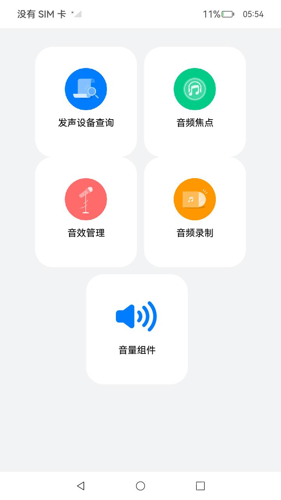
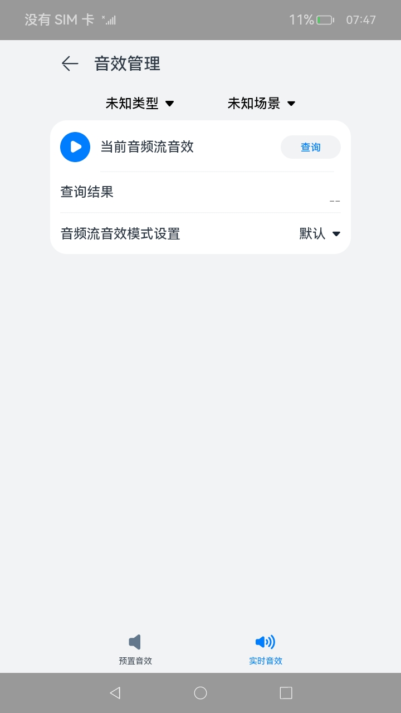
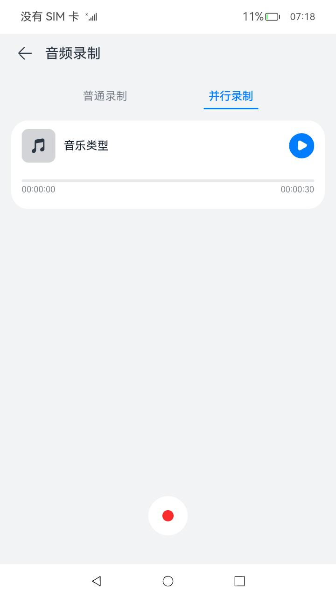
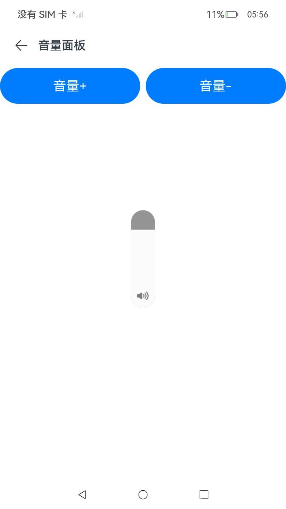

# 音频管理

### 介绍

本示例主要展示了音频的相关功能，使用[@ohos.multimedia.audio](https://docs.openharmony.cn/pages/v4.1/zh-cn/application-dev/reference/apis-audio-kit/js-apis-audio.md)等接口实现音频的发声设备的切换与查询、音频焦点、音效的查询与设置以及音频录制等功能

### 效果预览

| 主页                                   | 发声设备查询与选择页面  | 音频焦点页面 |
|--------------------------------------|-----------------------------------------|------------------------------------------------------|
| | |  |

| 音效管理页面-<br>预置音效查询                                    | 音效管理页面-<br>实时音效设置             | 音频录制页面-<br>普通录制             | 音频录制页面-<br>并行录制             |
|-----------------------------------------|----------------------------------------|----------------------------------------|----------------------------------------|
|  |  |  |  |

| 音量组件页面                                             | 音量组件页面-<br>音量面板                                                     |
|----------------------------------------------------|---------------------------------------------------------------------|
|  |  |

使用说明

注意：6，7，8是连续的串行操作，不是并行的

1. 弹出麦克风权限访问提示框，点击“允许”
2. 在主界面点击“发声设备查询与选择”按钮，进入发声设备查询与选择页面
3. 在发声设备查询与选择页面界面，展示当前发声设备类型名称
4. 在发声设备查询与选择页面界面，当设备存在“插入耳机”、“拔掉耳机”、“连接蓝牙”、“断开蓝牙”等操作行为时，当前发声设备类型名称会随之切换
5. 在发声设备查询与选择页面界面，点击“返回”按钮，回到主页
6. 在主界面点击“音频焦点”按钮，进入音频焦点页面
7. 在音频焦点页面，点击音乐播放器，音乐开始播放
8. 在音频焦点页面，点击铃声播放器，铃声开始播放，同时音乐被暂停
9. 在音频焦点页面，点击铃声播放器，停止铃声播放，音乐恢复播放
10. 在音频焦点页面，点击“返回”按钮，回到主页
11. 在主界面点击“音效管理”按钮，进入预置音效查询页面
12. 在预置音效查询页面，选择内容类型和场景后，点击“查询”按钮，预置音效模式会显示在下方查询结果中
13. 在预置音效查询页面，重新修改内容类型和场景，查询结果会重置
14. 在预置音效查询页面，点击右下方”实时音效设置“按钮，进入实时音效设置页面
15. 在实时音效设置页面，选择内容类型和场景后，点击播放按钮，音频流开始播放，同时内容类型和场景选择框被置灰
16. 在实时音效设置页面，点击”查询“按钮，当前音频流音效模式会显示在下方的查询结果中
17. 在实时音效设置页面，点击暂停按钮，音频流暂停，内容类型和场景选择框使能
18. 在实时音效设置页面，修改内容类型与场景选择，查询结果被重置
19. 在实时音效设置页面，再次点击播放按钮，音频流开始播放，点击”查询“按钮，结果显示在查询结果内
20. 在实时音效设置页面，在”音频流音效模式设置“选择框中选择另一种与上次查询结果不同的音效模式，可以听到音频流出现变化
21. 在实时音效设置页面，再次点击”查询“按钮，查询结果与上一步设置的模式相同
22. 在实时音效设置页面，点击左上方返回图标，回到主页
23. 在实时音效设置页面，点击左下方”预置音效查询“按钮，回到预置音效查询页面
24. 在主界面点击“音频录制”，进入音频录制界面，音频录制界面默认是普通录制界面
25. 在普通录制界面，点击录制按钮，开始录制，录音时间开始计时，5s内不允许结束
26. 在普通录制界面，点击暂停按钮，暂停录制，录音时间也停止计时
27. 在普通录制界面，点击继续按钮，继续录制，录音时间继续计时
28. 在普通录制界面，点击停止录制按钮，停止录制，也可以不停止录制，应用设置了30s的超时后，自动停止录制
29. 停止录制后，会生成录制结果，界面上有一个录制成功的音频播放器，点击播放可听到录制的音频
30. 点击并行录制按钮，可切换到并行录制界面
31. 在并行录制界面中，点击音乐播放器，播放音乐
32. 在并行录制界面中，点击录制按钮，开始录制，同时开启麦克风录制和屏幕录制，5s内不允许结束
33. 在并行录制界面中，点击停止录制按钮，停止录制，或者超时30s会自动停止录制，停止后按钮点成不可点击状态
34. 在并行录制界面中，录制停止后，会生成两个音频播放器，一个是麦克风的录音结果，一个是屏幕录制的结果，点击进行播放，暂停，播放结束自动停止
35. 点击返回按按钮回到主页
36. 在主界面点击“音量组件”按钮，进入音量组件页面
37. 在音量组件页面，点击“音量+”或“音量-”按钮，弹出音量面板
38. 在音量组件页面，点击左上方返回图标，回到主页

### 工程目录

```
entry/src/main/ets/
|---pages
|---|---Index.ets                           //首页
|---|---PreferOutputDevice.ets              //发声设备的查询与选择页面
|---|---Focus.ets                           //音频焦点页面
|---|---PresetEffect.ets                    //音效管理页面-预置音效查询
|---|---RealtimeEffect.ets                  //音效管理页面-实时音效设置
|---|---NormalCapturer.ets                  //音频录制-普通录制
|---|---ParallelCapturer.ets                //音频录制-并行录制
|---|---VolumePanel.ets                     //音量组件页面
library/
|---Logger.ts                               //日志打印封装
```

### 具体实现

* 发声设备查询与切换功能都封装在PreferOutputDevice,源码参考：[PreferOutputDevice.ets](entry/src/main/ets/pages/PreferOutputDevice.ets)
    * 使用audioRenderer对象来播放一个通话类型的音频，只要进入发声设备查询与选择页面就进行播放，直到退出当前页面
    * 使用audio.getAudioManager()来获取音频管理对象audioManager，再通过audioManager.getRoutingManager()对象获取audioRoutingManager对象
    * 使用audioRoutingManager.getPreferOutputDeviceForRendererInfo()获取当前发声设备
    * 使用audioRoutingManager.on('deviceChange',audio.DeviceFlag.OUTPUT_DEVICES_FLAG)来监听设备上下线
    * 当收到监听消息后，重新调用audioRoutingManager.getPreferOutputDeviceForRendererInfo()接口来查询当前发声设备
* 音频焦点功能都封装Focus，源码参考：[Focus.ets](entry/src/main/ets/pages/Focus.ets)
    * 使用audio.createAudioRenderer()接口分别创建音乐类型和铃声类型的audioRenderer对象
    * 对每个render对象都调用audioRenderer.setInterruptMode(audio.InterruptMode.INDEPENDENT_MODE),完成独立焦点的设置
    * 对每个render对象都监听audioRenderer.on('audioInterrupt'),收到回调时，说明当前renderer对象被暂停或者恢复播放，据此更新UI状态，如果是恢复，则需要再次调用audioRenderer.start()和wirte()进行恢复播放
    * 对每个render对象都监听audioRenderer.on('stateChange'),收到回调时，说明当前renderer对象的状态被改变，据此更新UI状态
    * 使用audioRenderer.start()方法和audioRenderer.write()进行音频的播放处理，写入字节的长度由audioRenderer.getBufferSize()接口来决定
    * 使用audioRenderer.stop()进行音频的停止播放处理
    * 使用resourceManager.getRawFd()接口加载工程里面的resources\rawfile下面的音频文件资源获取对应的文件描述对象fileDescriptor,接口参考：[@ohos.resourceManager](https://docs.openharmony.cn/pages/v4.0/zh-cn/application-dev/reference/apis/js-apis-resource-manager.md)
    * 根据文件描述对象，使用fs.read()接口进行音频数据读取，读取到的结果用于audioRenderer.write()的写入,接口参考：[@ohos.file.fs](https://docs.openharmony.cn/pages/v4.1/zh-cn/application-dev/reference/apis-core-file-kit/js-apis-file-fs.md)

* 预置音效查询功能都封装在PresetEffect, 源码参考：[PresetEffect.ets](entry/src/main/ets/pages/PresetEffect.ets)
    *  在选择框中的类型和场景映射为数字后, 作为之后调用的getAudioEffectInfoArray(content type:number, stream usage:number)的两个入参
    *  点击”查询“按钮后, 使用audio.getAudioManager()获取音频管理对象audioManager, 再通过audioManager.getStreamManager()对象获取audioStreamManager
    *  使用audioStreamManager.getAudioEffectInfoArray()获取当前的预置音效模式, api返回数字, 映射后显示在查询结果一栏
* 实时音效设置功能都封装在RealtimeEffect, 源码参考：[RealtimeEffect.ets](entry/src/main/ets/pages/RealtimeEffect.ets)
    *  点击播放调用createAudioRenderer(audioRendererOptions),其中的audioRendererOptions使用了在选择框中的类型和场景映射成的数字
    *  使用audioRenderer.start()方法和audioRenderer.write()进行音频的播放处理, 写入字节的长度由audioRenderer.getBufferSize()接口来决定
    *  使用resourceManager.getRawFd()接口加载工程里面的resources\rawfile下面的音频文件资源获取对应的文件描述对象fileDescriptor
    *  使用audioRenderer.pause()方法暂停音频流, 使用audioRenderer.stop()和audioRenderer.release()方法释放当前audioRenderer
    *  点击查询按钮, 调用audioRenderer.getAudioEffectMode()方法查询当前音频流的音效模式, 显示在查询结果内
    *  点击”音频流音效模式设置“选项, 调用audioRenderer.setAudioEffectMode()方法,设置要用的音效模式
    *  通过三个选择框的更新, audioRenderer的state和播放按钮状态的监视, 来触发UI状态的更新
    *  调用组件的.enabled(enabled: boolean)方法控制其置灰与使能

* 音频录制-普通录制功能都封装在NormalCapturer,源码参考：[NormalCapturer.ets](entry/src/main/ets/pages/NormalCapturer.ets)
    * 创建一个麦克风源的capturer对象用于录音
    * 点击开始录制时，调用capturer对象的start方法，同时调用capturer的read读取录音数据，并通过使用fs.write接口将录音数据写入到文件中去存储起来，接口参考：[@ohos.file.fs](https://docs.openharmony.cn/pages/v4.1/zh-cn/application-dev/reference/apis-core-file-kit/js-apis-file-fs.md)，同时利用setTimeout开启一个计时器，记录录音时间。
    * 点击暂停，调用capturer.stop(),同时文件写入也停止
    * 点击继续，再次调用capturer.start(),capturer.read()以及继续将录音数据写入到文件中去
    * 点击停止,调用capturer.stop(),同时文件写入也停止，录音结果生成成功，然后创建一个audioRenderer对象用于播放录音结果
    * 点击音频播放器，调用fs.read()读取数据，并将录音数据调用audioRenderer.wirte写入，进行播放
    * 再点击可以调用audioRenderer.pause()可以暂停音频播放，文件读取结束后自动调用audioRenderer.stop()停止音频播放
    * 退出音频录制，会调用caturer.ralease()，audioRenderer.release()释放资源和fs.close()关闭文件
* 音频录制-并行录制功能都封装在ParallelCapturer,源码参考：[ParallelCapturer.ets](entry/src/main/ets/pages/ParallelCapturer.ets)
    * 调用audio.createAudioRenderer(options)创建audioRendererMusic，options参数中privacyType设为0，renderInfo设为音乐类型，播放的音频流方可被屏幕录制录到
    * 调用audioRendererMusic.start(),pause(),stop()以及fs.read()等接口进行音乐的播放，暂停，停止操作
    * 分别利用audio.createAudioCapturer()创建一个麦克风源的audioCapturerNormal对象和一个屏幕录制源的audioCapturerScreen对象
    * 点击开始录制，则相继调用audioCapturerNormal.start()，audioCapturerScreen.start(),同时利用setTimeout开始计时,且还要分别调用audioCapturerNormal.read()，audioCapturerScreen.read(),以及调用fs.write将录音数据写入不同的文件
    * 点击停止录制，则相继调用audioCapturerNormal.stop()，audioCapturerScreen.stop()，同时利用clearInterval清除计时器，从而停止计时，同时也创建两个audiorenderer对象分别用于播放录音数据
    * 接下来就是分别调用两个audioRenderer对象的start,pause,stop以及fs.read等接口进行录音数据的播放，暂停，停止这些操作
* 音量组件功能都封装在VolumePanel,源码参考：[VolumePanel.ets](entry/src/main/ets/pages/VolumePanel.ets)
    * 调用AVVolumePanel组件创建音量面板,其中参数volumeLevel属于number类型,用于设置设备音量;参数volumeParameter属于AVVolumePanelParameter类型,用于设置音量面板的自定义参数
    * 点击”音量+”或”音量-”按钮,会传入不同的volumeLevel，从而弹出音量面板

### 相关权限

音频录制涉及的权限包括：

1.允许应用使用麦克风：[ohos.permission.MICROPHONE](https://gitee.com/openharmony/docs/blob/master/zh-cn/application-dev/security/AccessToken/permissions-for-all.md#ohospermissionmicrophone)

### 依赖

不涉及。

### 约束与限制

1. 本示例仅支持标准系统上运行，支持设备：RK3568；
2. 本示例仅支持API10版本SDK，SDK版本号(API Version 10 Release),镜像版本号(4.0Release)；
3. 本示例需要使用DevEco Studio 版本号(4.0Release)才可编译运行；

### 下载

如需单独下载本工程，执行如下命令：

```
git init
git config core.sparsecheckout true
echo Audio/Audio/ > .git/info/sparse-checkout
git remote add origin https://gitee.com/openharmony/applications_app_samples.git
git pull origin master
```