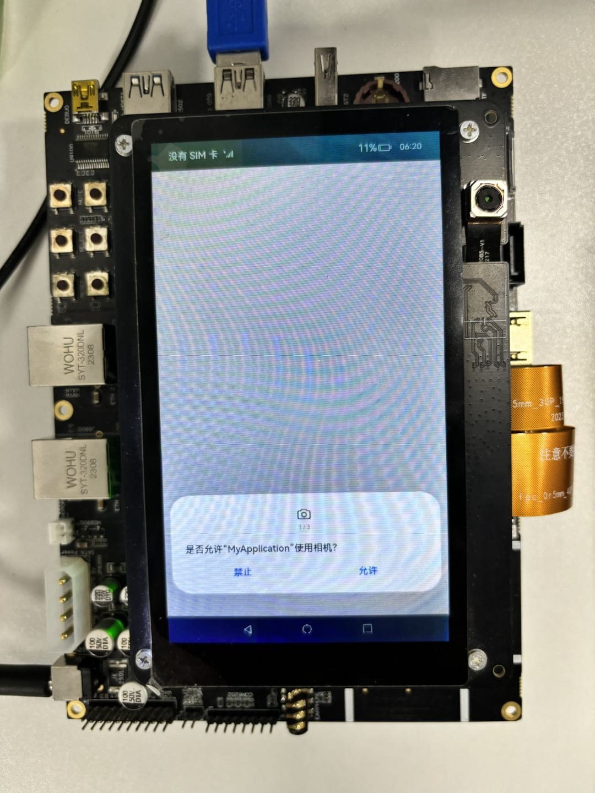
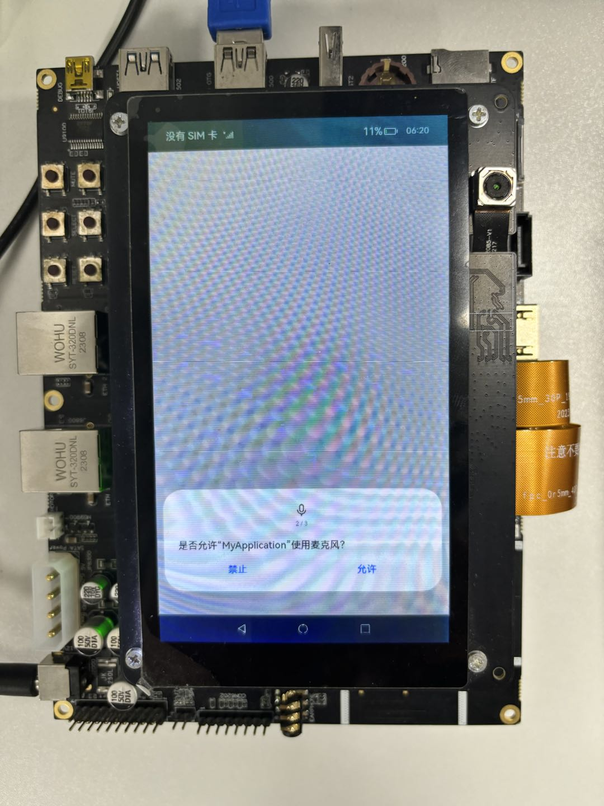
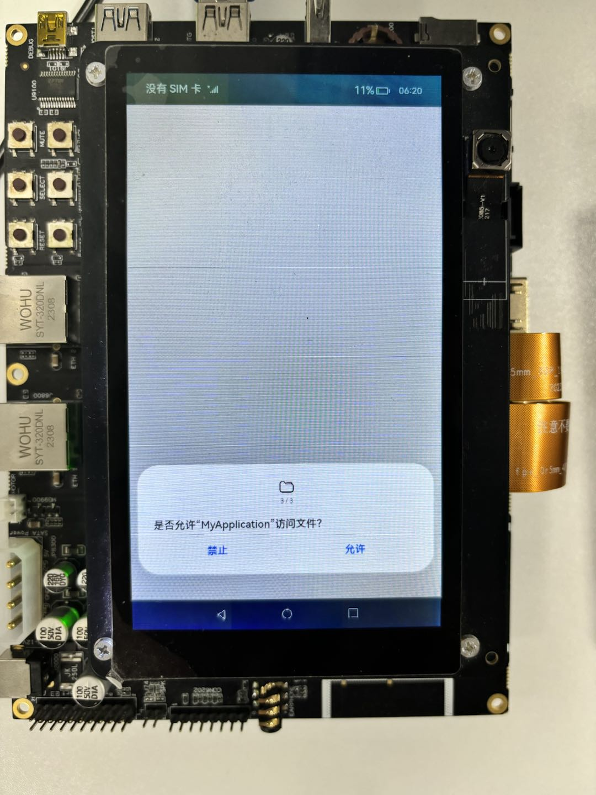
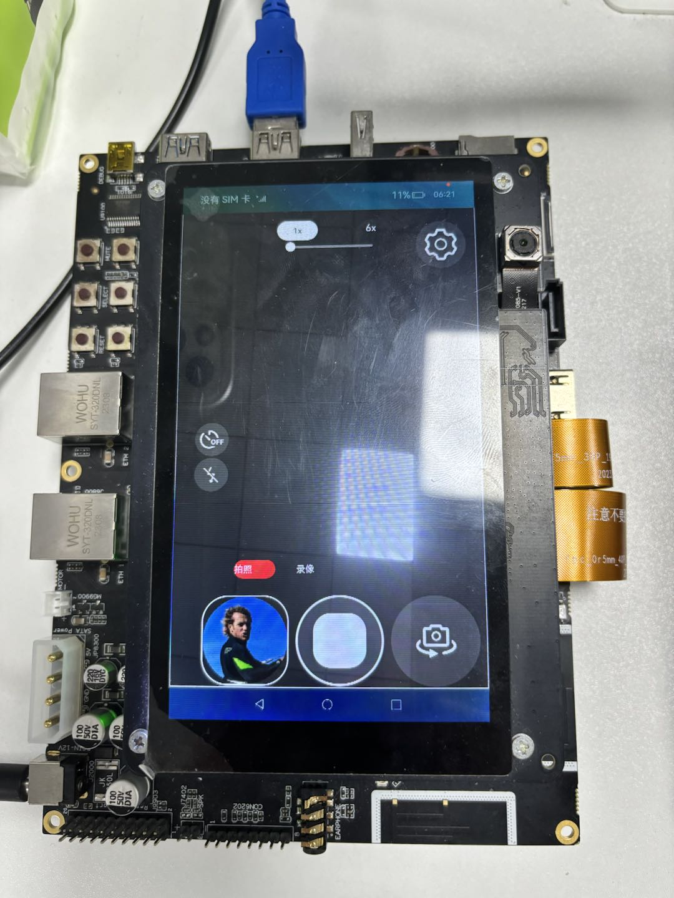

# CameraSample

### 介绍

本示例主要展示了相机的相关功能，使用[libohcamera.so]
当前版本sample仅用作联调，最新sdk未带相机c接口头文件。
接口实现相机的预览、拍照、录像、前后置摄像头切换进行拍照、录像，以及闪光灯、变焦、对焦、曝光等控制类功能。

### 效果预览

| 相机权限                       | 麦克风权限                      | 文件权限                       | 预览界面                            |
|----------------------------|----------------------------|----------------------------|---------------------------------|
|  |  |  |  |

使用说明
(因RK3568设备硬件能力，现仅支持验证1、2、3、9、10、13)
1. 弹出是否允许“CameraSample”使用相机？点击“允许”
2. 弹出是否允许“CameraSample”使用麦克风？点击“允许”
3. 弹出是否允许“CameraSample”访问文件？点击“允许”
4. 进入预览界面，预览正常，滑动变焦按钮，同一画面远近变焦效果明显
5. 进入预览界面，预览正常，点击画面模糊处，点击处画面会变得清晰，对焦效果明显
6. 进入预览界面，预览正常，上下滑动屏幕，屏幕场景亮度发生变化，曝光效果明显
7. 进入预览界面，预览正常，点击闪光灯按钮，打开闪光灯，闪光灯正常打开
8. 进入预览界面，预览正常，点击闪光灯按钮，关闭闪光灯，闪光灯关闭
9. 进入预览界面，预览正常，进入拍照模式，点击拍照按钮，拍照正常，左下角会生成照片缩略图，点击左下角缩略图，能够跳转到图库，图片保存正常，打开图片显示正常
10. 进入预览界面，预览正常，切换到录像模式，点击录像，开始录像，再点击停止录像按钮，录像成功，左下角会生成视频缩略图，点击左下角缩略图，能够跳转到图库，录像文件保存正常，播放录像文件正常
11. 进入预览界面，预览正常，切换到前置摄像头，点击拍照按钮，拍照正常，左下角会生成照片缩略图，点击左下角缩略图，能够跳转到图库，图片保存正常，打开图片显示正常
12. 进入预览界面，预览正常，切换到前置摄像头，切换到录像模式，点击录像，开始录像，再点击停止录像按钮，录像成功，左下角会生成视频缩略图，点击左下角缩略图，能够跳转到图库，录像文件保存正常，播放录像文件正常
13. 点击设置按钮，会弹出设置页面，仅验证UI。

### 工程目录

```
entry/src/main
|-- cpp
|   |-- CMakeLists.txt						// Cmake打包配置文件，编译工程动态库脚本，依赖头文件、cpp以及相关依赖
|   |-- camera_manager.cpp					// 相机基本功能接口定义cpp实现侧
|   |-- camera_manager.h					// 相机基本功能接口定义头文件
|   |-- main.cpp					        // NAPI实现JS与C++通信的接口
|   |-- types
|       `-- libentry
|           |-- index.d.ts      			// 导入NAPI接口供JS调用
|           `-- oh-package.json5			// 接口注册配置文件
|-- ets
|   |-- Dialog
|   |   |-- mainDialog.ets					// 打开相机APP弹出的网络权限设置
|   |   `-- settingDialog.ets			    // 相机APP设置界面布局
|   |-- MainAbility
|   |   `-- MainAbility.ts					// 对Ability生命周期管理
|   |-- common
|   |   |-- Constants.ts					// 基本参数枚举：纵横比、设备类型、视频帧数
|   |   |-- DisplayCalculator.ts			// 计算界面宽高显示数值
|   |   |-- settingItem.ets					// 设置栏
|   |   |-- settingPublicLayout.ets			// 设置栏公共区域
|   |   `-- settingRightLayout.ets			// 设置栏右边区域
|   |-- entryability
|   |   `-- EntryAbility.ts					// Ability的生命周期回调内容
|   |-- model
|   |   |-- DateTimeUtil.ts					// 日期工具
|   |   |-- Logger.ts						// 日志工具
|   |   `-- MediaUtils.ts					// 媒体工具
|   |-- pages
|   |   `-- Index.ets						// Ability实现的应用的入口页面，相机APP首页
|   `-- views
|       |-- CountdownPage.ets				// 倒计时UI页面布局
|       |-- FlashingLightPage.ets			// 闪光灯UI界面布局
|       |-- SlidePage.ets					// 滑动滑块UI界面布局
|       |-- dividerPage.ets					// 分割线UI布局
|       |-- focusAreaPage.ets				// 对焦区域设置（焦点、侧光点）、单指竖直方向拖动触发曝光补偿设置
|       |-- focusPage.ets					// 变焦、对焦、曝光、刻度的图标设置、值的设置
|       `-- modeSwitchPage.ets				// 相机功能模式切换，开启预览、拍照、录像

```

### 具体实现
* 相机功能接口实现在CameraManager.cpp中，源码参考：[CameraManager.cpp](entry/src/main/cpp/CameraManager.cpp)
    * 在NDKCamera构造函数里完成一个相机生命周期初始化的过程，包括调用OH_Camera_GetCameraMananger获取CameraMananger，调用OH_CameraManager_CreateCaptureSession创建CaptureSession，调用CaptureSessionRegisterCallback创建CaptureSession注册回调，调用GetSupportedCameras获取支持的camera设备，调用GetSupportedOutputCapability获取支持的camera设备能力集，调用CreatePreviewOutput创建预览输出，调用CreateCameraInput创建相机输入，调用CameraInputOpen打开相机输入，调用CameraManagerRegisterCallback创建CameraManager注册回调，最后调用SessionFlowFn开启Session。
    * 其中SessionFlowFn是一个开启预览的动作，主要流程包括：调用OH_CaptureSession_BeginConfig开始配置会话，调用OH_CaptureSession_AddInput把CameraInput加入到会话，调用OH_CaptureSession_AddPreviewOutput把previewOutput加入到会话，调用OH_CaptureSession_CommitConfig提交配置信息，调用OH_CaptureSession_Start开始会话工作，还有一步是在开启预览的同时调用IsFocusMode启动对焦功能，这边后面会涉及到。
    * 在NDKCamera析构函数里完成对相机生命周期释放的过程，调用OH_CameraManager_DeleteSupportedCameras删除支持的camera设备，调用OH_CameraManager_DeleteSupportedCameraOutputCapability删除支持的camera设备能力集，调用OH_Camera_DeleteCameraMananger删除camera manager。
    * 拍照功能相关接口封装在StartPhoto接口中，主要包含以下流程：调用SessionStop关闭session，调用SessionBegin做session的一个预置动作，调用CreatePhotoOutput创建相机输出，调用OH_CaptureSession_AddPhotoOutput将hotoOutput添加至session中，调用SessionCommitConfig提交session，在调用SessionStart开启session，最后调用TakePicture接口开启拍照动作。
    * 录像功能相关接口封装在StartVideo接口中，主要包含以下流程：调用SessionStop关闭session，调用SessionBegin做session的一个预置动作，调用OH_CaptureSession_RemovePhotoOutput移除相机拍照输出，再调用CreatePhotoOutput创建相机输出，调用AddPhotoOutput将相机输出添加至session中，调用CreateVideoOutput创建录像输出，调用AddVideoOutput将录像输出添加至session中，然后再调用SessionCommitConfig、SessionStart对session进行提交和开启，最后调用VideoOutputRegisterCallback对VideoOutput注册回调。
    * 闪光灯功能相关接口封装在HasFlashFn接口中，主要包含以下流程：调用OH_CaptureSession_HasFlash检测是否支持闪光灯设备，再调用OH_CaptureSession_IsFlashModeSupported检测闪光灯模式是否支持，然后调用OH_CaptureSession_SetFlashMode设置闪光灯模式，最后调用OH_CaptureSession_GetFlashMode获取当前设备的闪光灯模式。
    * 变焦功能相关接口封装在setZoomRatioFn接口中，主要包含以下流程：调用OH_CaptureSession_GetZoomRatioRange获取支持的变焦范围，调用OH_CaptureSession_SetZoomRatio设置变焦，调用OH_CaptureSession_GetZoomRatio获取当前设备的变焦值。
    * 曝光功能相关接口封装在IsExposureModeSupportedFn接口中，主要包含以下流程：调用OH_CaptureSession_IsExposureModeSupported判断是否支持曝光模式，然后调用OH_CaptureSession_SetExposureMode设置曝光模式，调用OH_CaptureSession_GetExposureMode获取设置后的曝光模式。调用IsExposureBiasRange接口获取曝光补偿，其中包含调用OH_CaptureSession_GetExposureBiasRange获取曝光补偿的范围，调用OH_CaptureSession_SetExposureBias设置曝光点，调用OH_CaptureSession_GetExposureBias获取曝光点。
    * 对焦功能相关接口封装在IsFocusMode接口中，主要包含以下流程：调用OH_CaptureSession_IsFocusModeSupported判断是否支持对焦模式，调用OH_CaptureSession_SetFocusMode设置对焦模式，调用OH_CaptureSession_GetFocusMode获取设置后的对焦模式。调用IsFocusPoint接口获取对焦点，其中包括调用OH_CaptureSession_SetFocusPoint获取JS侧下发来的对焦点位，然后调用OH_CaptureSession_GetFocusPoint获取设置后的对焦点位。
    * 视频防抖功能相关接口封装在IsVideoStabilizationModeSupportedFn接口中，主要包含以下流程：调用OH_CaptureSession_IsVideoStabilizationModeSupported接口查询是否支持指定的视频防抖模式，调用OH_CaptureSession_SetVideoStabilizationMode设置视频防抖，调用OH_CaptureSession_GetVideoStabilizationMode获取设置后的视频防抖模式。

    * 回调接口设置：
        * CameraManagerRegisterCallback：监听相机状态回调，在打开、退出相机，相机摄像头切换时会触发
        * CameraInputRegisterCallback：相机输入发生错误时触发回调
        * PreviewOutputRegisterCallback：开启预览流时触发回调
        * PhotoOutputRegisterCallback：开启拍照时触发回调
        * VideoOutputRegisterCallback：开启录像模式时触发回调
        * MetadataOutputRegisterCallback：有metadata流输出时触发回调
        * CaptureSessionRegisterCallback：session出现异常时以及开启对焦模式时触发回调


* 相机预览、拍照、录像功能、前后置切换功能实现调用侧位于tableIndex.ets，modeSwitchPage.ets，main.cpp中，源码参考：[tableIndex.ets](entry/src/main/cpp/ets/pages/tableIndex.ets)，[modeSwitchPage.ets](entry/src/main/cpp/ets/views/modeSwitchPage.ets)，[main.cpp](entry/src/main/cpp/main.cpp)
    * 预览：开启预览位于tableIndex.ets下的onPageShow接口，其中调用cameraDemo.initCamera接口，将预览的surfaceId，对焦模式的值，以及是前置还是后置摄像头设备作为入参啊传下去，实际调用的是main.cpp下的InitCamera接口，InitCamera接口将JS侧拿到的参数进行转换再传入cameraManager.cpp中的构造函数里去，完成开启相机的操作，开启预览并设置好对焦模式。
    * 拍照和录像：开启拍照位于modeSwitchPage.ets下的isVideoPhotoFn接口，通过判断modelBagCol的值是photo还是video，将modelBagCol的值，videoId，拍照的surfaceID或者录像的surfaceId传入接口startPhotoOrVideo。如果是拍照模式，则通过modeSwitchPage.ets下的getPhotoSurfaceID接口获取photo surfaceId，跳转到main.cpp中的StartPhotoOrVideo接口，将传下来的参数进行格式转换，再调用CameraManager对象下的StartPhoto接口开启拍照操作；如果是录像模式，则通过modeSwitchPage.ets下的getVideoSurfaceID接口获取video surfaceId，跳转到main.cpp中的StartPhotoOrVideo接口，将传下来的参数进行格式转换，再调用CameraManager对象下的StartVideo接口开启录像操作
    * 前后置切换：前后置摄像头切换接口位于modeSwitchPage.ets，切换cameraDeviceIndex，将先前的session配置释放，调用cameraDemo.releaseSession接口，实际上是main.cpp下的ReleaseSession接口，最终调用到CameraMangaer.cpp下的ReleaseSession接口。然后将预览的surfaceId，对焦模式的值以及cameraDeviceIndex传入cameraDemo.initCamera接口中，逻辑和预览一致。


* 相机闪光灯、变焦、对焦、曝光功能实现调用侧位于FlashingLightPage.ets，SlidePage.ets，focusAreaPage.ets中，源码参考：[FlashingLightPage.ets](entry/src/main/cpp/ets/views/FlashingLightPage.ets)，[SlidePage.ets](entry/src/main/cpp/ets/views/SlidePage.ets)，[focusAreaPage.ets](entry/src/main/cpp/ets/views/focusAreaPage.ets)，[main.cpp](entry/src/main/cpp/main.cpp)
    * 闪光灯：闪光灯功能位于FlashingLightPage.ets，getImageDefault接口用作在点击闪光灯图标之后选择闪光灯模式，0代表关闭，1代表打开，2是自动，3是常亮。然后在build中通过cameraDemo.hasFlash接口调用到main.cpp中的HasFlash接口，最终调到CameraManager.cpp中的HasFlashFn接口，完成闪光灯功能的实现。
    * 变焦：变焦功能位于SlidePage.ets，通过调用slideChange接口设置slide滑块的值，目前只支持1-6.然后调用cameraDemo.setZoomRatio接口调用到main.cpp中的SetZoomRatio接口，最终调到CameraManager.cpp中的setZoomRatioFn接口，完成变焦功能的实现。
    * 对焦：对焦功能位于focusAreaPage.ets，通过在build中将对焦焦点下发到cpp侧，在CameraManager.cpp文件中的SessionFlowFn函数中，会调用IsFocusMode接口来判断是否支持对焦模式，然后通过onTouch的方式将对焦点位通过cameraDemo.isFocusPoint接口下发到main.cpp侧的IsFocusPoint接口，最终调到CameraManager.cpp中的IsFocusPoint接口。以及调用OH_CaptureSession_SetFocusMode拿到对焦点位来设置对焦模式，最后调用OH_CaptureSession_GetFocusMode来获取对焦模式，完成对焦功能实现。
    * 曝光：曝光功能位于focusAreaPage.ets，通过在build中将侧光点位下发到cpp侧，然后通过onTouch的方式将对焦点位以及侧光点位通过cameraDemo.isFocusPoint接口下发到main.cpp侧的isMeteringPoint接口，最终调到CameraManager.cpp中的IsMeteringPoint接口。然后设置曝光补偿，单指竖直方向拖动触发该手势事件，调用gesture中的cameraDemo.isExposureBiasRange接口将曝光值下发到main.cpp中的IsExposureBiasRange，然后经过napi转换后将值传到CameraManager.cpp中的IsExposureBiasRange接口，之后从native侧发到曝光补偿的范围，再调用OH_CaptureSession_SetExposureBias设置曝光值，最后调用OH_CaptureSession_GetExposureBias接口获取曝光值，完成曝光功能。

### 相关权限

[ohos.permission.CAMERA](https://gitee.com/openharmony/docs/blob/master/zh-cn/application-dev/reference/apis-camera-kit/js-apis-camera.md)

[ohos.permission.MICROPHONE](https://gitee.com/openharmony/docs/blob/master/zh-cn/application-dev/security/AccessToken/permissions-for-all.md#ohospermissionmicrophone)

[ohos.permission.READ_MEDIA](https://gitee.com/openharmony/docs/blob/master/zh-cn/application-dev/security/AccessToken/permissions-for-all.md#ohospermissionread_media)

[ohos.permission.WRITE_MEDIA](https://gitee.com/openharmony/docs/blob/master/zh-cn/application-dev/security/AccessToken/permissions-for-all.md#ohospermissionwrite_media)

### 依赖

不涉及

### 约束与限制

1. 本示例支持标准系统上运行，支持设备：RK3568；
2. 本示例为Stage模型，已适配API version 10版本SDK，SDK版本号(API Version 10 Release)，镜像版本号(4.0Release)；
3. 本示例需要使用DevEco Studio 版本号(4.0.0.600)及以上版本才可编译运行。

### 下载

如需单独下载本工程，执行如下命令：

```
git init
git config core.sparsecheckout true
echo Camera/Camera/ > .git/info/sparse-checkout
git remote add origin https://gitee.com/openharmony/applications_app_samples.git
git pull origin master
```