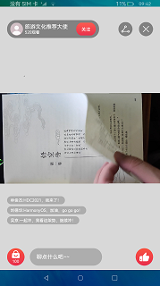

# 媒体库视频

### 介绍

本示例使用[Video组件](https://docs.openharmony.cn/pages/v4.1/zh-cn/application-dev/reference/apis-arkui/arkui-ts/ts-media-components-video.md)展示了视频组件的基本功能，包括视频组件化，全屏化，窗口化，上下轮播视频等。

### 效果预览
|首页|弹窗|视频|直播|
|------|--------|-------|---------|
|||||

使用说明：
1. 进入首页点击播放按键；
2. 点击视频播放按钮，视频开始播放,再次点击视频进入视频全屏页；
3. 首页下滑500vp后，视频小窗口化；
4. 点击直播按钮进入直播页，上下滑动视频。

### 目录结构
```
VideoComponent/src/main/ets/components
|---mock
|   |---LiveData.ets                            // mock直播弹幕数据
|---model
|   |---LiveDataModel.ets                       // 弹幕数据结构
|---net
|   |---Utils.ets
|---pages                                  
|   |---CommentPage.ets                         // 评论页面
|   |---FullPage.ets                            // 全屏播放视频页
|   |---LivePage.ets                            // 直播页面
|   |---MainPage.ets                            // 首页
|   |---SmallVideo.ets                          // 小窗口
|   |---VideoPage.ets                           // 视频播放页
```
### 具体实现
  + 视频播放：start方法视频开始播放，源码参考[VideoPage.ets](VideoComponent/src/main/ets/components/pages/VideoPage.ets)；
  + 全屏播放：再次点击视频进入全屏播放页面，使用setCurrentTime参数设定当前播放时间，pause方法停止播放，源码参考[FullPage.ets](VideoComponent/src/main/ets/components/pages/FullPage.ets);
  + 小窗口播放：记录当前播放时间，小窗口页面渲染之前设置视频当前播放时间，页面滚动到固定距离开始展示组件；
  + 直播：使用[http](https://gitee.com/openharmony/docs/blob/master/zh-cn/application-dev/reference/apis-network-kit/js-apis-http.md)接口的request方法获取直播数据，代码参考[Utils.ets](VideoComponent/src/main/ets/components/net/Utils.ets);

### 相关权限

[ohos.permission.INTERNET](https://gitee.com/openharmony/docs/blob/master/zh-cn/application-dev/security/AccessToken/permissions-for-all.md#ohospermissioninternet)

### 依赖

不涉及。

### 约束与限制

1.本示例仅支持标准系统上运行,支持设备:RK3568。

2.本示例已适配API version 9版本SDK，版本号：3.2.11.9。

3.本示例需要使用DevEco Studio 3.1 Beta2 (Build Version: 3.1.0.400, built on April 7, 2023)及以上版本才可编译运行。

### 下载
如需单独下载本工程，执行如下命令：
```
git init
git config core.sparsecheckout true
echo code/BasicFeature/Media/VideoShow/ > .git/info/sparse-checkout
git remote add origin https://gitee.com/openharmony/applications_app_samples.git
git pull origin master
```
