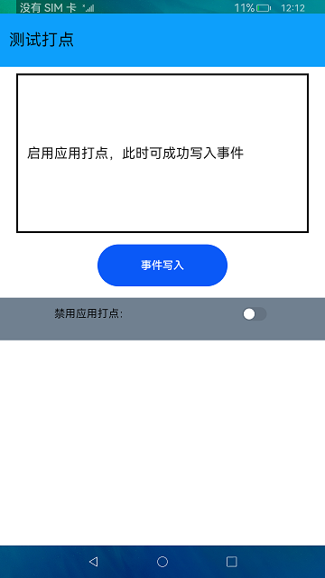

# 测试打点

### 介绍

本示例展示了在eTS中如何获取应用故障相关信息，测试打点包括应用打点与性能打点两部分，应用打点通过调用`hiAppEvent`接口来记录应用运行过程中发生的各种信息。

### 效果预览

|主页|
|--------------------------------|
||

使用说明

1.点击"事件写入"按钮，显示成功写入事件。

2.打开"禁用应用打点"开关，再次点击"事件写入"按钮，显示事件写入失败。

3.关闭"禁用应用打点"开关，再次点击"事件写入"按钮，显示事件写入成功。

### 工程目录
```
entry/src/main/ets/
|---entryAbility
|   |---EntryAbility.ts
|---model
|   |---Logger.ts                      // 日志工具
|---pages
|   |---DotTestPage.ets                // 首页
```
### 具体实现

* 该示例使用hiAppEvent接口中write方法将事件写入到当天的事件文件中，EventType方法枚举事件类型，configure方法去配置打点开关来实现测试打点。
* 源码链接：[DotTestPage.ets](entry/src/main/ets/pages/DotTestPage.ets)
* 接口参考：[@ohos.hiviewdfx.hiAppEvent](https://gitee.com/openharmony/docs/blob/master/zh-cn/application-dev/reference/apis-performance-analysis-kit/js-apis-hiviewdfx-hiappevent.md)

### 相关权限

不涉及。

### 依赖

不涉及。

### 约束与限制

1.本示例仅支持在标准系统上运行。

2.性能打点验证只能通过上述命令获取日志来进行验证。

3.本示例已适配API version 9版本SDK，版本号：3.2.11.9。

4.本示例需要使用DevEco Studio 3.1 Beta2 (Build Version: 3.1.0.400 构建 2023年4月7日)及以上版本才可编译运行。

### 下载
如需单独下载本工程，执行如下命令：

```
git init
git config core.sparsecheckout true
echo code/BasicFeature/DFX/DotTest/ > .git/info/sparse-checkout
git remote add origin https://gitee.com/openharmony/applications_app_samples.git
git pull origin master
```