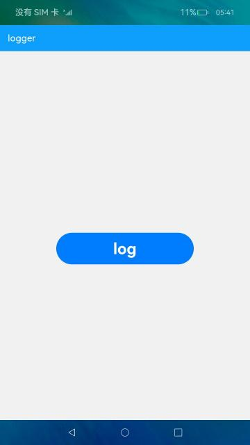

# 日志打印

### 介绍

本示例使用[hilog日志系统](https://docs.openharmony.cn/pages/v4.1/zh-cn/application-dev/reference/apis-performance-analysis-kit/js-apis-hilog.md) ，提供日志打印类，使应用/服务可以按照指定级别、标识和格式字符串输出日志内容，帮助开发者了解应用/服务的运行状态，更好地调试程序。

### 效果预览
|首页|
|---------|
||

使用说明：

1.进入应用会自动生成一个空的日志文件。

2.点击log按钮即可输出日志，并将日志生成到日志文件当中。

### 工程目录
```
entry/src/main/ets/
|---pages
|   |---Index.ets                           // 首页
log/src/main/ets/
|---components
|   |---mainpage
|   |   |---Configure.ets                   // 日志打印配置项
|   |   |---Logger.ets                      // 日志打印类
|   |   |---LoggerModel.ts                  // 封装日志打印类
|   |   |---LogLevel.ts                     // 日志等级枚举值
```

### 具体实现
+ 日志输出功能封装在Logger，源码参考:[Logger.ets](log/src/main/ets/components/mainpage/Logger.ets):
    + 日志输出：Logger类根据Configure的types参数将日志分为三个类型，其中file类型会将日志写入本地文件，console类型调用ConsoleLoggerStrategy类输出，hilog类型调用HilogLoggerStrategy类输出;
    + 日志文件写入本地：FileLoggerStrategy类使用[@ohos.file.fs](https://gitee.com/openharmony/docs/blob/master/zh-cn/application-dev/reference/apis-core-file-kit/js-apis-file-fs.md) 将日志写入本地文件中，本示例只是展示了文件写入文件操作的使用方法，在实战场景中，建议把耗时操作放入子线程中运行。

### 相关权限

不涉及。

### 依赖

不涉及。

### 约束与限制

1.本示例已适配API version 9版本SDK，版本号：3.2.11.9;

2.本示例需要使用DevEco Studio 3.1 Beta2 (Build Version: 3.1.0.400 构建 2023年4月7日)及以上版本才可编译运行。

### 下载
如需单独下载本工程，执行如下命令：
```
git init
git config core.sparsecheckout true
echo code/BasicFeature/DFX/Logger/ > .git/info/sparse-checkout
git remote add origin https://gitee.com/openharmony/applications_app_samples.git
git pull origin master
```

