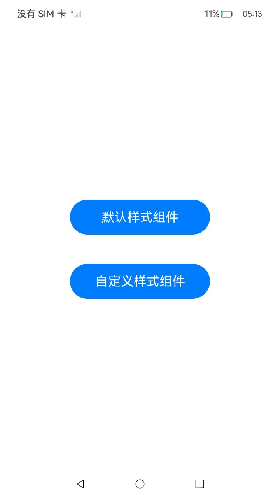
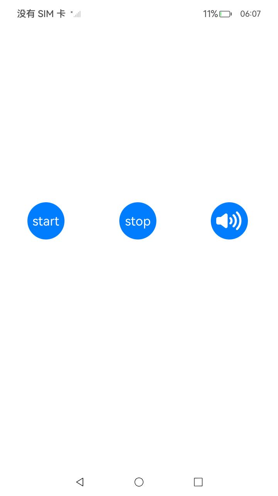
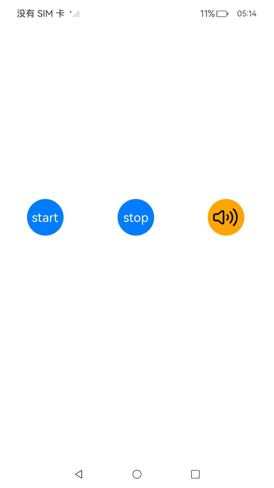

# 通话设备切换

### 介绍

本示例主要展示了通话设备切换的相关功能，使用[@ohos.multimedia.avCastPicker](https://gitee.com/openharmony/docs/blob/master/zh-cn/application-dev/reference/apis-avsession-kit/ohos-multimedia-avcastpicker.md)和[@ohos.multimedia.avCastPickerParam](https://gitee.com/openharmony/docs/blob/master/zh-cn/application-dev/reference/apis-avsession-kit/js-apis-avCastPickerParam.md)等接口实现通话设备切换功能。

> 注意：
> 通话设备切换按钮可显示默认样式或者自定义样式，默认样式由系统提供，自定义组件由应用提供。还可参考相关的[开发指南](https://gitee.com/openharmony/docs/blob/master/zh-cn/application-dev/media/avsession/using-switch-call-devices.md)。

### 效果预览

| 主页 | 默认样式页面 | 自定义样式页面 |
|-------------------------------- | -------------------------------- | -------------------------------- |
|  |  |  |

### 使用说明

1. 点击进入主页，可以选择点击按钮默认样式组件和自定义样式组件，如果点击默认样式组件，跳转到显示默认样式的页面；点击自定义样式组件，跳转到显示自定义样式的页面；
2. 进入页面后，有三个按钮，分别是start,stop和设备切换按钮，点击start按钮，可播放音频，点击stop，可暂停音频， 点击设备切换按钮，可选择当前输出设备并显示设备对应的样式。

### 工程目录

项目中关键的目录结构如下：

```
entry/src/main/ets/
|---pages
|---|---Index.ets                                  //初始界面实现
|---|---DefaultPicker.ets                          //默认样式实现
|---|---CustomPicker.ets                           //自定义样式实现

```

### 具体实现

#### 初始界面实现

  初始界面相关的实现都封装在pages/Index.ets下，源码参考：[pages/Index.ets](./entry/src/main/ets/pages/Index.ets)。

  * 界面显示两个按钮分别为默认样式组件和自定义样式组件，可分别跳转到系统默认样式实现界面和自定义样式实现界面，相关代码如下：

    ```ets
    Button() {
      // 按钮的内容
    }
    .onClick(async() => {
      await router.pushUrl({ url:'pages/DefaultPicker' });//系统默认样式实现
    })

    Button() {
      // 按钮的内容
    }
    .onClick(async() => {
      await router.pushUrl({ url:'pages/CustomPicker' });//自定义样式实现
    })
    ```
#### 默认系统样式

  默认系统样式的相关内容封装在pages/DefaultPicker.ets下，源码参考：[pages/DefaultPicker.ets](./entry/src/main/ets/pages/DefaultPicker.ets)。

  * 在需要切换设备的通话界面创建AVCastPicker组件。

    ```ets
    import { AVCastPicker } from '@kit.AVSessionKit';
    
    AVCastPicker({
      normalColor: this.avCastPickerColor,
      activeColor: this.avCastPickerColor,
    })
      .size({ width: 45, height: 45 })
    ```

  * 拉起组件前需创建voice_call类型的AVSession，AVSession在构造方法中支持不同的类型参数，由AVSessionType定义，voice_call表示通话类型。

    ```ets
    import { avSession } from '@kit.AVSessionKit';

    init() {
      //...
      this.session = await avSession.createAVSession(this.appContext, 'voiptest', 'voice_call');
    }
    ```

  * 创建VOICE_COMMUNICATION类型的AudioRenderer，并播放，可模拟通话场景：

    * 创建如下三个变量。

    ```ets
    private audioRendererInfo: audio.AudioRendererInfo = {
      usage: audio.StreamUsage.STREAM_USAGE_VOICE_COMMUNICATION,
      rendererFlags: 0
    }
    private audioStreamInfo: audio.AudioStreamInfo = {
      samplingRate: audio.AudioSamplingRate.SAMPLE_RATE_48000, // 采样率
      channels: audio.AudioChannel.CHANNEL_2, // 通道
      sampleFormat: audio.AudioSampleFormat.SAMPLE_FORMAT_S16LE, // 采样格式
      encodingType: audio.AudioEncodingType.ENCODING_TYPE_RAW // 编码格式
    }
    private  audioRendererOption: audio.AudioRendererOptions = {
      streamInfo: this.audioStreamInfo,
      rendererInfo: this.audioRendererInfo
    }
    ``` 
    
    * 调用 startRenderer() 播放音频。

    * 调用 stopRenderer() 暂停播放音频。

#### 自定义样式

  自定义样式的相关内容封装在pages/CustomPicker.ets下，源码参考：[pages/CustomPicker.ets](./entry/src/main/ets/pages/CustomPicker.ets)。

  * 在需要切换设备的通话界面创建AVCastPicker组件。

    ```ets

    import { AVCastPicker } from '@kit.AVSessionKit';

    @State pickerImage: ResourceStr = $r('app.media.ic_earpiece');

    @Builder
    ImangeBuilder(): void {
      Image(this.pickerImage)
        .size({ width: '100%', height: '100%' })
        .backgroundColor('#00000000')
        .fillColor(Color.Black)
    }
    
    Column() {
      Button() {
        AVCastPicker({
          normalColor: this.avCastPickerColor,
          activeColor: this.avCastPickerColor,
          customPicker: (): void => this.ImangeBuilder(),
          onStateChange: (state: AVCastPickerState) => {
            console.error(`change avcastpicker: ${state}`);
          }
        })
          .size({ width: 45, height: 45 })
      }
      .size({ width: 64, height: 64 })
      .type(ButtonType.Circle)
      .backgroundColor(Color.Orange)
    }
      .size({ width: '33%', height: 64 })

    ```

  * 拉起组件前也需创建voice_call类型的AVSession。为了保证能够正常更新样式，需要监听当前设备切换，如果当前设备切换，将刷新显示样式

    ```ets

    import { avSession } from '@kit.AVSessionKit';
    import { audio } from '@kit.AudioKit';

    init(){
      this.session = await avSession.createAVSession(this.appContext, 'voiptest', 'voice_call');
      this.observerDevices();
    }

    async observerDevices() {
      if(!this.audioRoutingManager) {
        return;
      }
      let desc: audio.AudioDeviceDescriptors = this.audioRoutingManager.getPreferredOutputDeviceForRendererInfoSync(this.audioRendererInfo);
      this.changePickerShow(desc);
      audioRoutingManager.on('preferOutputDeviceChangeForRendererInfo', this.audioRendererInfo, (desc: audio.AudioDeviceDescriptors) => {
        if(!this.audioRoutingManager) {
          return;
        }
        console.log(`device change to: ${desc[0].deviceType}`);
        let devices: audio.AudioDeviceDescriptors = this.audioRoutingManager.getPreferredOutputDeviceForRendererInfoSync(this.audioRendererInfo);
        this.changePickerShow(devices);
      });
    }

    private changePickerShow(desc: audio.AudioDeviceDescriptors) {
      if (desc[0].deviceType === 2) {
        this.pickerImage = $r('app.media.ic_public_sound');
      } else if (desc[0].deviceType === 7) {
        this.pickerImage = $r('app.media.ic_bluetooth');
      } else {
        this.pickerImage = $r('app.media.ic_earpiece');
      }
    }
    
    ```

  * 创建VOICE_COMMUNICATION类型的AudioRenderer，并播放，可模拟通话场景，具体实现如默认样式。

### 相关权限

不涉及

### 依赖

不涉及

### 约束与限制

1. 本示例仅支持标准系统上运行。

2. 本示例为Stage模型，支持API12版本SDK，SDK版本号(API Version 12 Release),镜像版本号(5.0 Release)。

3. 本示例需要使用DevEco Studio 版本号(5.0 Release)及以上版本才可编译运行。

4. 本示例手机设备支持，RK暂不支持。

### 下载

如需单独下载本工程，执行如下命令：

```
git init
git config core.sparsecheckout true
echo code/BasicFeature/Media/AVSession/AvCastPickerForCall > .git/info/sparse-checkout
git remote add origin https://gitee.com/openharmony/applications_app_samples.git
git pull origin master
```
