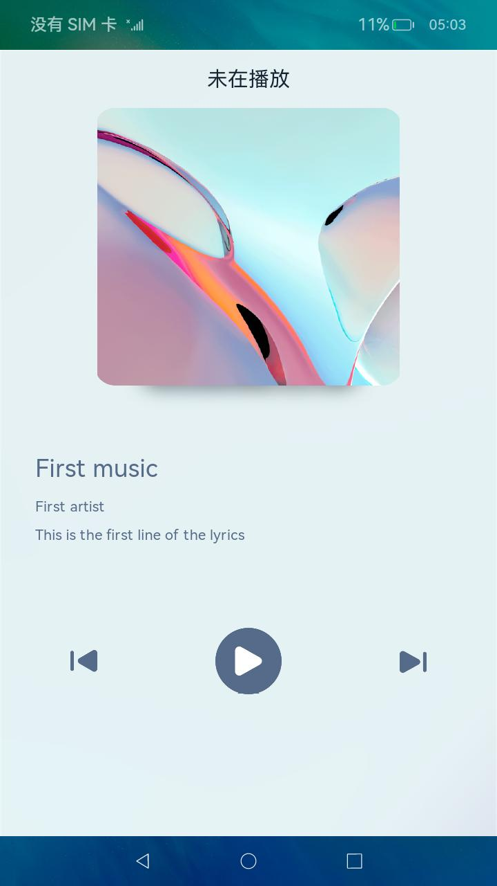

# 媒体会话——提供方

### 介绍

本示例主要展示了媒体会话（媒体提供方）的相关功能，使用[@ohos.multimedia.avsession](https://docs.openharmony.cn/pages/v4.0/zh-cn/application-dev/reference/apis/js-apis-avsession.md)等接口实现媒体提供方与媒体控制方自定义信息的交互功能。

> 注意：
> 此示例仅展示媒体提供方的相关功能，如果需要媒体会话提供的完整的自定义信息交互功能，请将本示例与[媒体提供方示例](../MediaController/README.md)共同使用。

### 效果预览

|主页|
|--------------------------------|
||

#### 使用说明

##### 基础操作

1. 打开媒体提供方示例应用。
2. 点击播放按钮，应用的播放状态发生变化，歌词开始更新。
3. 点击暂停按钮，应用的播放状态开始变化，歌词停止更新。
4. 点击上一首按钮，应用界面展示播放列表中的上一首歌曲的信息。
5. 点击下一首按钮，应用界面展示播放列表中的下一首歌曲的信息。

##### 进阶操作（与媒体控制方一起使用）
1. 点击本应用播放、暂停、上一首、下一首按钮，可以发现媒体控制方中，该会话的状态同步改变。
2. 点击媒体控制方按钮，可以发现本应用中播放状态同步改变。
3. 媒体控制方可以获取到本应用的播放列表、自定义数据包、歌词等信息。


### 工程目录

给出项目中关键的目录结构并描述它们的作用，示例如下：

```
entry/src/main/ets/
|---common
|---|---Log.ets                             //日志打印封装
|---|---MediaData.ets                       //歌曲相关信息
|---|---Utils.ets                           //通用的工具类
|---feature
|---|---ProviderFeature.ets                 //逻辑实现
|---pages
|---|---Index.ets                           //界面实现
```

### 具体实现

* 界面相关的实现都封装在pages/Index.ets下，源码参考：[pages/Index.ets](./entry/src/main/ets/pages/Index.ets)
  * 使用`@StorageLink`来设置与逻辑代码同步更新的变量，当逻辑代码中对应的变量更新时，界面会同步的刷新。

  * 通过引入逻辑代码对应的类，创建出对象，实现对onClick事件的响应，关键代码段：
    ```ets
    import { ProviderFeature } from '../feature/ProviderFeature';
    private providerFeature: ProviderFeature = new ProviderFeature(); // 创建对象
    
    Button() {
      // 按钮的内容
    }
    .onClick(async () => {
      this.providerFeature.play(); // 通过类的对象来调用逻辑代码
    })
    ```

* 逻辑相关的实现都封装在feature/ProviderFeature.ets下，源码参考：[feature/ProviderFeature.ets](./entry/src/main/ets/feature/ProviderFeature.ets)

  应用的初始化相关操作

  * 链接变量

    通过`AppStorage.SetAndLink()`将逻辑代码中的变量与界面代码中使用`@StorageLink`声明的变量连接起来，通过`set()`与`get()`操作来修改或获取变量的值，关键代码段：

    ```ets
    private isPlayLink: SubscribedAbstractProperty<boolean> = null;
    this.isPlayLink = AppStorage.SetAndLink('IsPlaying', false);
    this.isPlayLink.set(false); // 设置变量的值
    let currentState : boolean = this.isPlayLink.get(); // 获取变量的值
    ```


  * 创建并设置媒体会话

    通过接口`createAVSession()`创建媒体会话；

    通过接口`activate()`激活媒体会话；

    通过接口`setAVQueueItems()`设置播放列表，设置后媒体控制方可以读取使用该信息；

    通过接口`setAVQueueTitle()`设置播放列表标题，设置后媒体控制方可以读取使用该信息；

    通过接口`setAVMetadata()`设置当前媒体的元数据，设置后媒体控制方可以读取使用此信息；

    通过接口`on()`开启对媒体控制方控制命令的监听，对媒体控制方的命令进行处理；

  应用在运行中相关的操作

  * 切换歌曲

    在切换歌曲时，除了需要设置媒体提供方自身的状态，还需要使用接口`setAVPlaybackState()`与接口`setAVMetadata()`将当前播放状态与元数据同步给媒体控制方。

  * 发送自定义数据包

    媒体提供方可以使用接口`dispatchSessionEvent()`与接口`setExtras()`来发送自定义数据包。

### 相关权限

1. 长时任务权限ohos.permission.KEEP_BACKGROUND_RUNNING

   如果需要让媒体提供方应用在后台运行或响应命令，需要注册长时任务权限[ohos.permission.KEEP_BACKGROUND_RUNNING](https://gitee.com/openharmony/docs/blob/master/zh-cn/application-dev/security/AccessToken/permissions-for-all.md#ohospermissionkeep_background_running)
   
   请在需要后台运行的Ability的`module.json5`中添加以下配置：
  
   ```json5
   {
      "module": {
         "requestPermissions": [
           {
              "name": "ohos.permission.KEEP_BACKGROUND_RUNNING"
           }
         ]
      }
   }
   ```
   
   添加配置后，需要在逻辑代码中进行申请长时任务的操作，示例代码如下：
   
   ```ets
   async startContinuousTask(){
     let wantAgentInfo = {
       wants:[
         {
           bundleName:"com.samples.mediaprovider",
           abilityName:"com.samples.mediaprovider.EntryAbility"
         }
       ],
       operationType : WantAgent.OperationType.START_ABILITY,
       requestCode: 0,
       wantAgentFlags: [WantAgent.WantAgentFlags.UPDATE_PRESENT_FLAG]
     };
     let want = await WantAgent.getWantAgent(wantAgentInfo);
     await backgroundTaskManager.startBackgroundRunning(globalThis.context, backgroundTaskManager.BackgroundMode.AUDIO_PLAYBACK,want);
   }
   ```

### 依赖

此示例仅展示媒体提供方的相关功能，如果需要媒体会话提供的完整的自定义信息交互功能，请将本示例与[媒体提供方示例](../MediaController/README.md)共同使用。

### 约束与限制

1. 本示例仅支持标准系统上运行，支持设备：RK3568。

2. 本示例为Stage模型，支持API10版本SDK，SDK版本号(API Version 10 Release),镜像版本号(4.0 Release)

3. 本示例需要使用DevEco Studio 版本号(4.0 Release)及以上版本才可编译运行。

### 下载

如需单独下载本工程，执行如下命令：

```
git init
git config core.sparsecheckout true
echo code/BasicFeature/Media/AVSession/MediaProvider > .git/info/sparse-checkout
git remote add origin https://gitee.com/openharmony/applications_app_samples.git
git pull origin master
```
