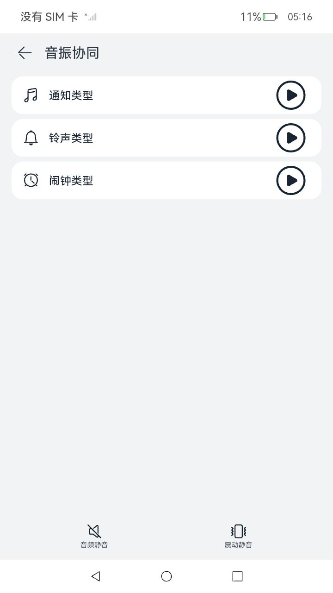
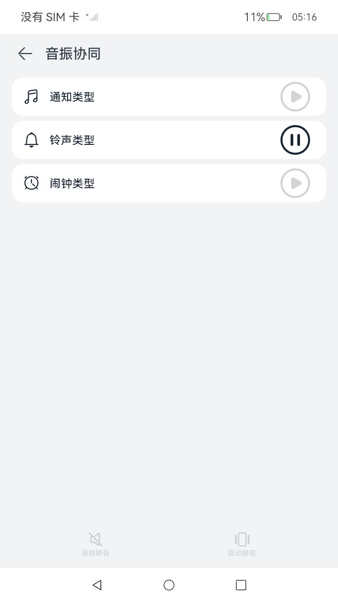

# 音振

### 介绍

本示例主要展示了音振协同功能，使用[@ohos.multimedia.audioHaptic](https://docs.openharmony.cn/pages/v4.1/zh-cn/application-dev/reference/apis-audio-kit/js-apis-audioHaptic.md)等接口提供播放音频同时伴随振动的功能，可用于同时需要声音与振动的场景。

### 效果预览

| 主页                                     | 音振协同播放类型选择页面 | 音振协同播放铃声页面 |
|----------------------------------------|-----------------------------------------|------------------------------------------------------|
|  |  | |

使用说明

注意：当选择任意一种类型开始播放时，其它按钮均不可点击

1. 在主界面点击“音振协同”按钮，进入音振协同播放类型选择页面
2. 在音振协同播放类型选择页面，展示音振协同播放类型
3. 在音振协同播放类型选择页面，点击通知类型播放器，通知类型开始播放并振动
4. 在音振协同播放类型选择页面，点击铃声类型播放器，铃声类型开始播放并振动
5. 在音振协同播放类型选择页面，点击闹钟类型播放器，闹钟类型开始播放并振动
6. 在音振协同播放类型选择页面，点击“音频静音”（未点击振动静音），选择铃声类型播放器进行播放，铃声类型开始音频静音同时振动播放，直至播放自动结束，恢复暂停状态
7. 在音振协同播放类型选择页面，点击“振动静音”（未点击音频静音），选择铃声类型播放器进行播放，铃声类型开始无振动同时有声播放，直至播放自动结束，恢复暂停状态
8. 在音振协同播放类型选择页面，点击“振动静音”，点击“音频静音”，选择铃声类型播放器进行播放，铃声类型开始无振动同时无声播放，直至播放自动结束，恢复暂停状态
9. 音振协同播放选择页面，点击“返回”按钮，可返回主页

### 工程目录

```
entry/src/main/ets/
|---pages
|---|---Index.ets                           //首页
|---|---AudioHaptics.ets                    //音振协同页面
library/
|---Logger.ts                               //日志打印封装
```

### 具体实现
* 音振协同功能都封装AudioHaptics，源码参考：[AudioHaptic.ets](entry/src/main/ets/pages/AudioHaptic.ets)
    * 使用audioHaptic.getAudioHapticManager()接口获取音振管理器。
    * 使用audioHapticManager.registerSource(audioUri, hapticUri)接口注册音频和振动资源的Uri，返回注册资源的source id。
    * 使用使用audioHapticManager.setStreamUsage()接口给指定source id设置音频使用类型。
    * 使用audioHapticManager.createPlayer(id, options)创建不同类型资源的音振播放器。
    * 使用audioHapticManager.setStreamUsage(id, streamUsage )分别设置通知类型、铃声类型和闹钟类型的使用类型。
    * 对每个player对象都监听AudioHapticPlayer .on('endOfStream'),收到回调时,说明当前类型资源播放结束，恢复暂停播放状态，据此更新UI状态。
    * 使用audioHapticManager.start()方法进行对指定类型音频开始播放处理。
    * 使用audioHapticManager.stop()进行指定类型音频的停止播放处理。

### 相关权限

允许应用控制马达振动:[ohos.permission.VIBRATE](https://gitee.com/openharmony/docs/blob/master/zh-cn/application-dev/security/AccessToken/permissions-for-all.md#ohospermissionvibrate)

### 依赖

不涉及。

### 约束与限制

1. 本示例仅支持有马达的设备上运行；
2. 本示例仅支持标准系统上运行，支持设备：目前该功能仅支持部分机型；
3. 本示例仅支持API11版本SDK，SDK版本号(API Version 11 Release),镜像版本号(4.0Release)；
4. 本示例需要使用DevEco Studio 版本号(4.0Release)才可编译运行；

### 下载

如需单独下载本工程，执行如下命令：

```
git init
git config core.sparsecheckout true
echo code/BasicFeature/Media/AudioHaptic > .git/info/sparse-checkout
git remote add origin https://gitee.com/openharmony/applications_app_samples.git
git pull origin master
```