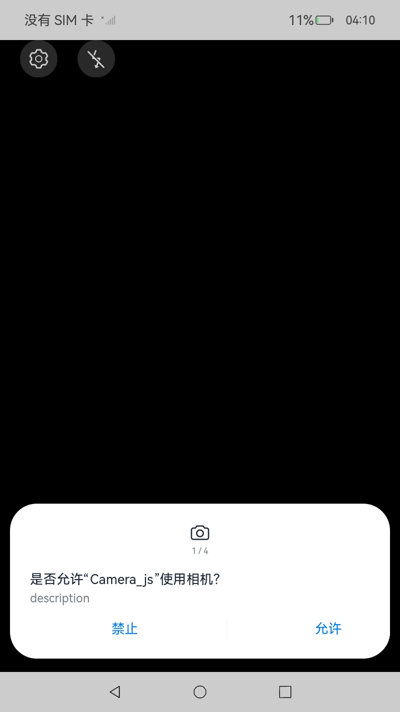
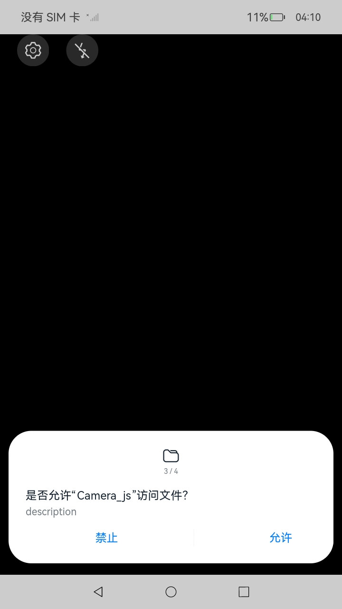
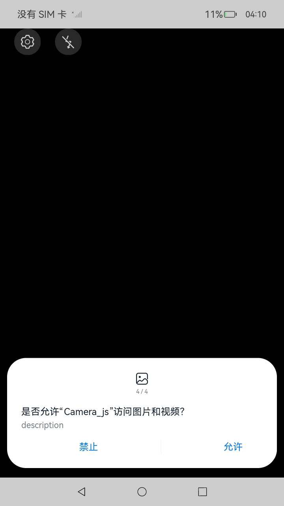
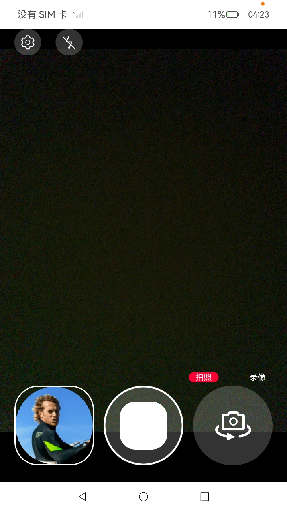
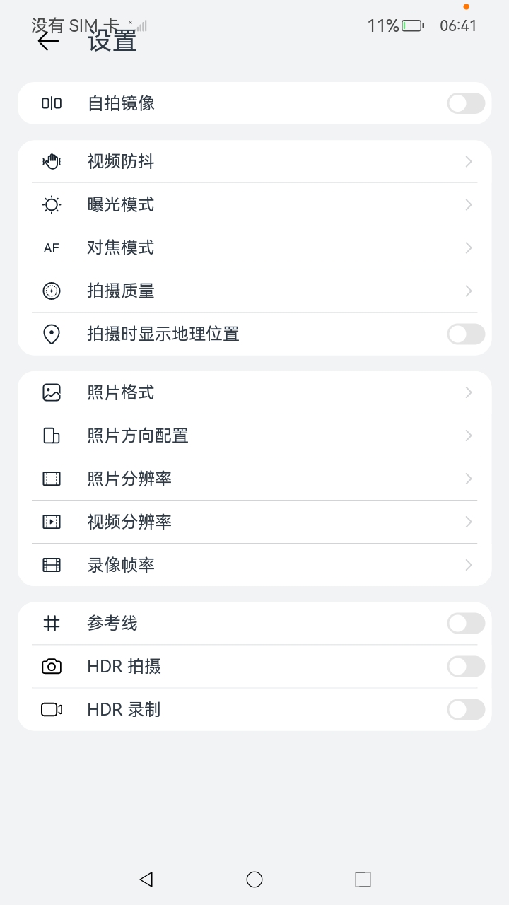

# 相机

### 介绍

本示例主要展示了相机的相关功能，使用[@ohos.multimedia.camera](https://gitee.com/openharmony/docs/blob/master/zh-cn/application-dev/reference/apis-camera-kit/js-apis-camera.md)等接口实现相机的预览、拍照、录像、前后置摄像头切换进行拍照、录像，以及闪光灯、变焦、对焦、曝光等控制类功能。

### 效果预览

| 相机权限                        | 麦克风权限                       | 文件权限                        |
|-----------------------------|-----------------------------|-----------------------------|
|  |  |  |

| 图片和视频权限                     | 预览界面                            | 设置界面                            |
|-----------------------------|---------------------------------|---------------------------------|
|  |  |  |

使用说明
(因RK3568设备硬件能力，现仅支持验证1、2、3、4、9、10、13)
1. 弹出是否允许“Camera_js”使用相机？点击“允许”
2. 弹出是否允许“Camera_js”使用麦克风？点击“允许”
3. 弹出是否允许“Camera_js”访问文件？点击“允许”
4. 弹出是否允许“Camera_js”访问图片和视频？点击“允许”
5. 进入预览界面，预览正常，点击画面模糊处，点击处画面会变得清晰，对焦效果明显
6. 进入预览界面，预览正常，上下滑动屏幕，屏幕场景亮度发生变化，曝光效果明显
7. 进入预览界面，预览正常，点击闪光灯按钮，打开闪光灯，闪光灯正常打开
8. 进入预览界面，预览正常，点击闪光灯按钮，关闭闪光灯，闪光灯关闭
9. 进入预览界面，预览正常，进入拍照模式，点击拍照按钮，拍照正常，左下角会生成照片缩略图
10. 进入预览界面，预览正常，切换到录像模式，点击录像，开始录像，再点击停止录像按钮，录像成功，左下角会生成视频缩略图
11. 进入预览界面，预览正常，切换到前置摄像头，点击拍照按钮，拍照正常，左下角会生成照片缩略图
12. 进入预览界面，预览正常，切换到前置摄像头，切换到录像模式，点击录像，开始录像，再点击停止录像按钮，录像成功，左下角会生成视频缩略图
13. 点击设置按钮，会弹出设置页面，仅验证UI

### 工程目录

```
entry/src/main
|-- ets
|   |-- Application
|   |-- |-- MyAbilityStage.ts               // AbilityStage的生命周期回调内容
|   |-- common
|   |   |-- CameraConfig.ts                 // 相机配置信息
|   |   |-- Constants.ts					// 基本参数枚举：纵横比、设备类型、视频帧数
|   |   |-- DisplayCalculator.ts			// 计算界面宽高显示数值
|   |   |-- GlobalContext.ts			    // 全局上下文
|   |   |-- settingItem.ets					// 设置栏
|   |   |-- SettingList.ets					// 设置栏跳转配置
|   |   |-- settingPublicLayout.ets			// 设置栏公共区域
|   |   |-- settingRightLayout.ets			// 设置栏右边区域
|   |-- Dialog
|   |   |-- RecodeStopDialog.ets			// 停止录像弹框
|   |   |-- SettingDialog.ets			    // 相机APP设置界面布局
|   |-- Entryability
|   |   |-- EntryAbility.ts					// Ability的生命周期回调内容
|   |-- MainAbility
|   |   |-- MainAbility.ts					// 对Ability生命周期管理
|   |-- model
|   |   |-- CameraService.ts				// 相机功能实现
|   |   |-- DateTimeUtil.ts					// 日期工具
|   |   |-- Logger.ts						// 日志工具
|   |-- pages
|   |   |-- Index.ets						// Ability实现的应用的入口页面，相机APP首页
|   `-- views
|       |-- CountdownPage.ets				// 倒计时UI页面布局
|       |-- DividerPage.ets					// 分割线UI布局
|       |-- FlashingLightPage.ets			// 闪光灯UI界面布局
|       |-- FocusAreaPage.ets				// 对焦区域设置（焦点、侧光点）、单指竖直方向拖动触发曝光补偿设置
|       |-- FocusPage.ets					// 变焦、对焦、曝光、刻度的图标设置、值的设置
|       |-- ModeSwitchPage.ets				// 相机功能模式切换，开启预览、拍照、录像
|       |-- SlidePage.ets					// 滑动滑块UI界面布局

```

### 具体实现
* 相机功能接口实现在CameraService.ts中，源码参考：[CameraService.ts](entry/src/main/ets/model/CameraService.ts)
    * 在initCamera接口里完成一个相机生命周期初始化的过程，包括调用getCameraManagerFn获取相机管理器实例，调用getSupportedCamerasFn获取支持的camera设备，调用initProfile初始化设备能力集，调用createPreviewOutputFn创建预览输出， 调用previewOutputCallBack监听预览事件，调用createPhotoOutputFn创建拍照输出流，调用photoOutPutCallBack监听拍照事件，调用createCameraInputFn创建相机输入，调用cameraInputOpenFn打开相机，调用onCameraStatusChange监听镜头状态，调用onCameraInputChange监听CameraInput的错误事件。
    * 在photoSessionFlowFn接口里开启拍照预览的动作，主要流程包括：调用createSession创建PhotoSession实例，调用beginConfig开始配置会话，调用addInput把cameraInput加入到会话，调用addOutput把previewOutput加入到会话，调用addOutput把photoOutPut加入到会话，调用setColorSpace设置色域，调用commitConfig提交配置信息，调用start开始会话工作。
    * 在takePicture接口里执行拍照动作，主要流程包括：调用capture执行拍照，拍照完成时回调photoOutPut的photoAvailable监听，调用savePicture接口保存照片。
    * 在videoSessionFlowFn接口里开启录像预览的动作，主要流程包括：调用createSession创建VideoSession实例，调用beginConfig开始配置会话，调用addInput把cameraInput加入到会话，调用addOutput把previewOutput加入到会话，调用addOutput把videoOutPut加入到会话，调用setColorSpace设置色域，调用commitConfig提交配置信息，调用start开始会话工作。
    * 在startVideo接口里执行录像工作，主要流程包括：调用videoOutput的start和videoRecorder的start接口启动录制。
    * 闪光灯功能相关接口封装在HasFlashFn接口中，主要包含以下流程：调用hasFlash检测是否支持闪光灯设备，再调用isFlashModeSupported检测闪光灯模式是否支持，然后调用setFlashMode设置闪光灯模式，最后调用getFlashMode获取当前设备的闪光灯模式。
    * 变焦功能相关接口封装在setZoomRatioFn接口中，主要包含以下流程：调用getZoomRatioRange获取支持的变焦范围，调用setZoomRatio设置变焦，调用getZoomRatio获取当前设备的变焦值。
    * 曝光功能相关接口封装在IsExposureModeSupportedFn接口中，主要包含以下流程：调用isExposureModeSupported判断是否支持曝光模式，然后调用setExposureMode设置曝光模式，调用getExposureMode获取设置后的曝光模式。调用IsExposureBiasRange接口获取曝光补偿，其中包含调用getExposureBiasRange获取曝光补偿的范围，调用setExposureBias设置曝光点。
    * 对焦功能相关接口封装在isFocusMode接口中，主要包含以下流程：调用isFocusModeSupported判断是否支持对焦模式，调用setFocusMode设置对焦模式。调用IsFocusPoint接口获取对焦点，其中包括调用setFocusPoint设置对焦点位，然后调用getFocusPoint获取设置后的对焦点位。
    * 视频防抖功能相关接口封装在IsVideoStabilizationModeSupportedFn接口中，主要包含以下流程：调用OisVideoStabilizationModeSupported接口查询是否支持指定的视频防抖模式，调用setVideoStabilizationMode设置视频防抖，调用getActiveVideoStabilizationMode获取设置后的视频防抖模式。

* 相机预览、拍照、录像功能、前后置切换功能实现调用侧位于Index.ets，modeSwitchPage.ets，CameraService.ts中，源码参考：[Index.ets](entry/src/main/ets/pages/Index.ets)，[ModeSwitchPage.ets](entry/src/main/ets/views/ModeSwitchPage.ets)，[CameraService.ts](entry/src/main/ets/model/CameraService.ts)
    * 预览：开启预览位于Index.ets下的onPageShow接口，其中调用CameraService.initCamera接口，将预览的surfaceId，摄像头id作为入参传下去，完成开启相机的操作，开启预览。
    * 拍照和录像：开启拍照位于ModeSwitchPage.ets下的isVideoPhotoFn接口，通过判断modelBagCol的值是photo还是vide。如果是拍照模式，调用CameraService.takePicture接口开启拍照。如果是录像模式，调用CameraService.startVideo接口开启录像。
    * 前后置切换：前后置摄像头切换接口位于ModeSwitchPage.ets，切换cameraDeviceIndex，将先前的session配置释放，CameraService.initCamera接口，将预览的surfaceId，摄像头id作为入参传下去，先释放之前的session，然后进行初始化操作开启预览。


* 相机闪光灯、变焦、对焦、曝光功能实现调用侧位于FlashingLightPage.ets，SlidePage.ets，FocusAreaPage.ets中，源码参考：[FlashingLightPage.ets](entry/src/main/ets/views/FlashingLightPage.ets)，[SlidePage.ets](entry/src/main/ets/views/SlidePage.ets)，[FocusAreaPage.ets](entry/src/main/ets/views/FocusAreaPage.ets)，[CameraService.ts](entry/src/main/ets/model/CameraService.ts)
    * 闪光灯：闪光灯功能位于FlashingLightPage.ets，getImageDefault接口用作在点击闪光灯图标之后选择闪光灯模式，0代表关闭，1代表打开，2是自动，3是常亮。然后在build中通过CameraService.hasFlash接口调用到CameraService.ts中的HasFlash接口，完成闪光灯功能的实现。
    * 变焦：变焦功能位于SlidePage.ets，通过调用slideChange接口设置slide滑块的值，目前只支持1-6.然后调用CameraService.setZoomRatioFn接口完成变焦功能的实现。
    * 对焦：对焦功能位于FocusAreaPage.ets，通过调用CameraService.isFocusPoint完成对焦功能实现。
    * 曝光：曝光功能位于FocusAreaPage.ets，通过调用CameraService.isMeteringPoint完成曝光功能。

### 相关权限

[ohos.permission.CAMERA](https://gitee.com/openharmony/docs/blob/master/zh-cn/application-dev/reference/apis-camera-kit/js-apis-camera.md)

[ohos.permission.MICROPHONE](https://gitee.com/openharmony/docs/blob/master/zh-cn/application-dev/security/AccessToken/permissions-for-all.md#ohospermissionmicrophone)

[ohos.permission.READ_MEDIA](https://gitee.com/openharmony/docs/blob/master/zh-cn/application-dev/security/AccessToken/permissions-for-all.md#ohospermissionread_media)

[ohos.permission.WRITE_MEDIA](https://gitee.com/openharmony/docs/blob/master/zh-cn/application-dev/security/AccessToken/permissions-for-all.md#ohospermissionwrite_media)

[ohos.permission.READ_IMAGEVIDEO](https://gitee.com/openharmony/docs/blob/master/zh-cn/application-dev/security/AccessToken/permissions-for-system-apps.md#ohospermissionread_imagevideo)

### 依赖

不涉及

### 约束与限制

1. 本示例支持标准系统上运行，支持设备：RK3568；
2. 本示例为Stage模型，已适配API version 10版本SDK，SDK版本号(API Version 10 Release)，镜像版本号(4.0Release)；
3. 本示例需要使用DevEco Studio 版本号(4.0.0.600)及以上版本才可编译运行。

### 下载

如需单独下载本工程，执行如下命令：

```
git init
git config core.sparsecheckout true
echo Camera/Camera/ > .git/info/sparse-checkout
git remote add origin https://gitee.com/openharmony/applications_app_samples.git
git pull origin master
```