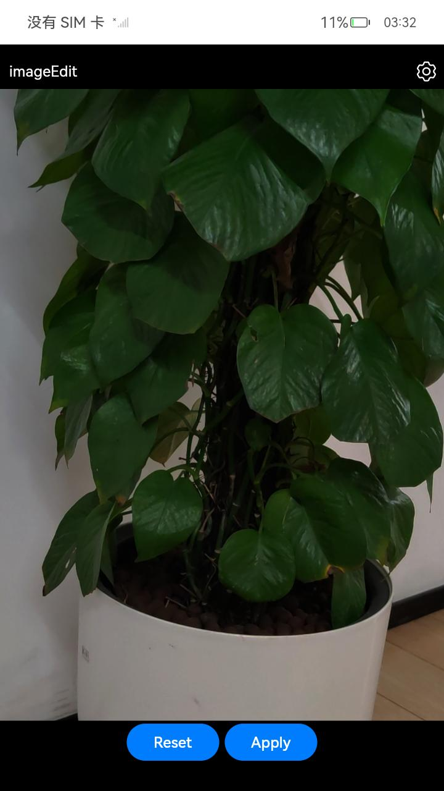
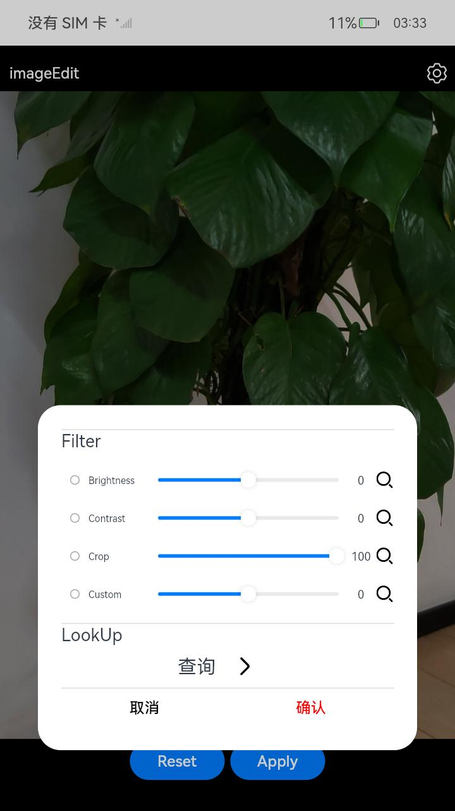
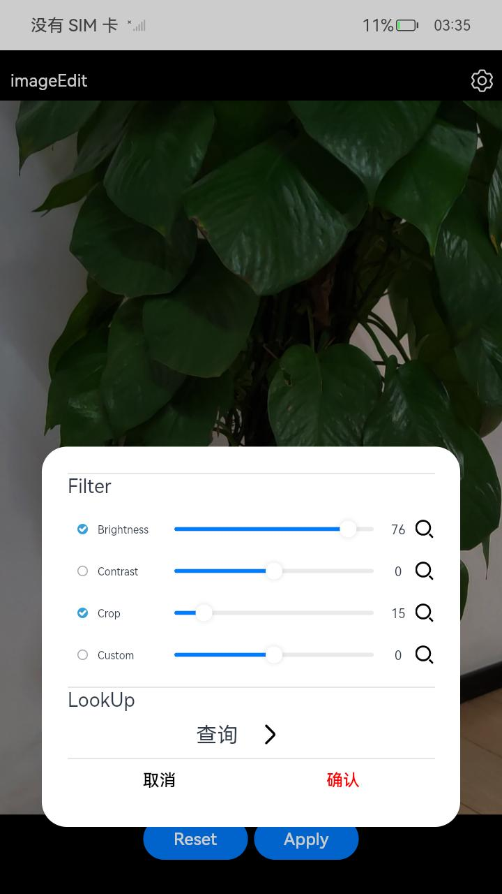
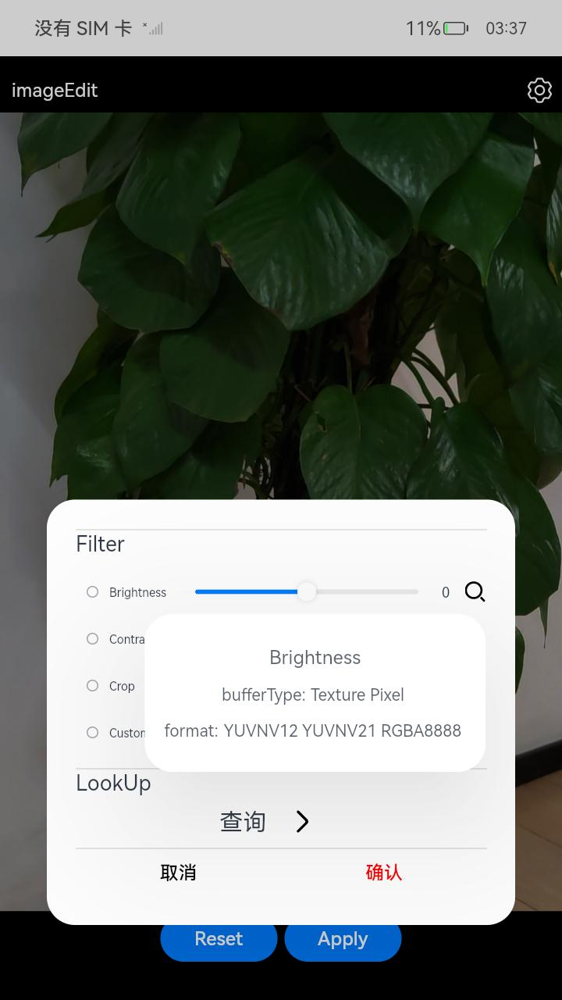
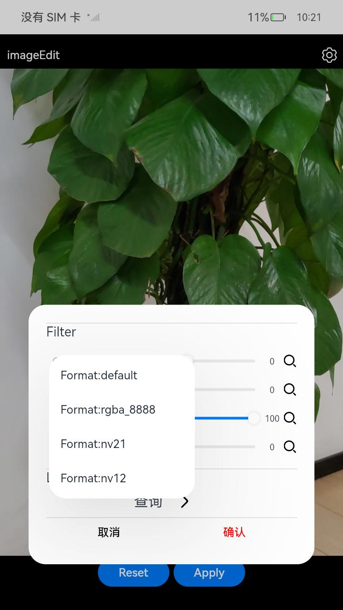
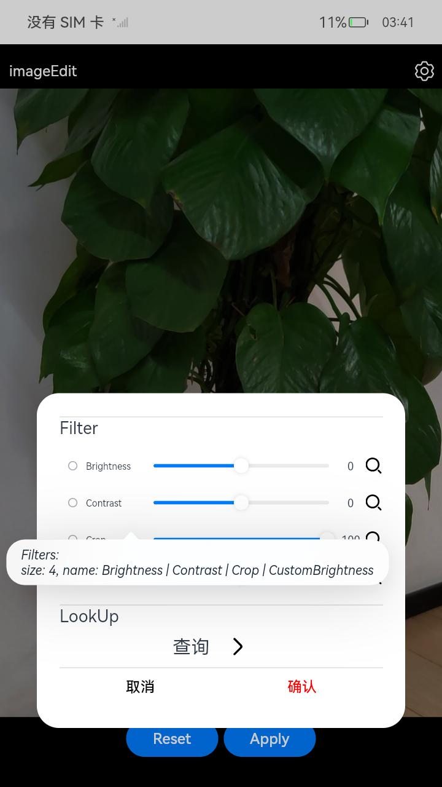
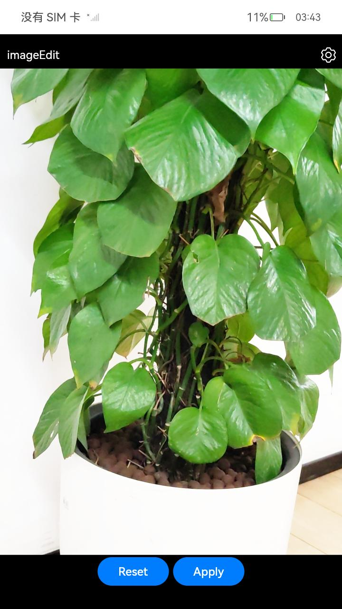
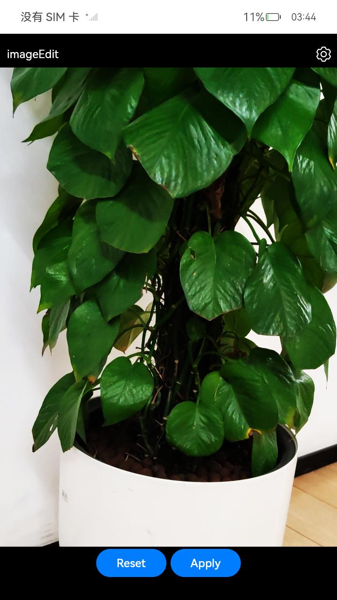
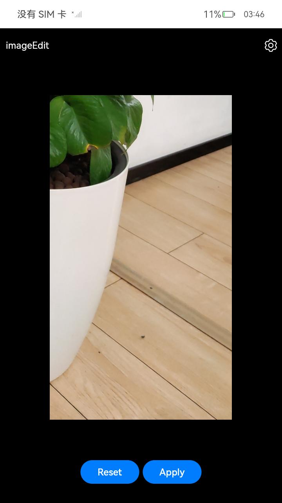
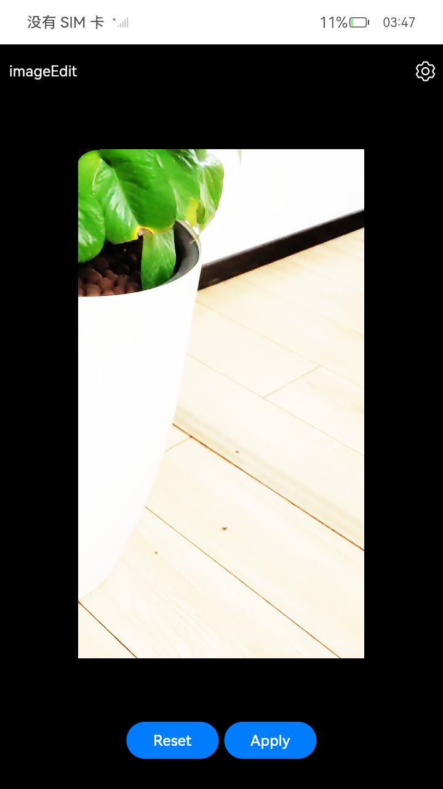

# 图片编辑

### 介绍

在本示例中，图片编解码模块提供了强大的图像处理功能。该模块能够有效生成pixelMap对象，供更进一步的图像操作使用。

- 算子接口整合

  通过提供的图像算子接口，本示例支持对图片亮度、对比度以及裁剪等属性的调整。Brightness（亮度）、Contrast（对比度）和Crop（裁剪）等算子为开发者提供了便捷的方式来实现图片的基本处理需求。

- 自定义滤镜算子及算子链拓展<br>

  框架为开发者设计了自定义算子接口，允许在已有功能基础上添加个性化的滤镜效果。开发者可以依照特定需求设计并集成新的算子，实现图像处理功能。

- 功能查询接口<br>

  框架还提供了查询接口，允许开发者查询单个算子或整个算子链的详细信息。

### 效果预览

|                           图片展示                           |                           滤镜参数                           |                           滤镜选择                           |
| :----------------------------------------------------------: | :----------------------------------------------------------: | :----------------------------------------------------------: |
|  |  |  |

|                           滤镜信息                           |                           查询参数                           |                           查询信息                           |
| :----------------------------------------------------------: | :----------------------------------------------------------: | :----------------------------------------------------------: |
|  |  |  |

|                         图片亮度调节                         |                        图片对比度调节                        |                         图片裁剪调节                         |                        图片滤镜链调节                        |
| :----------------------------------------------------------: | :----------------------------------------------------------: | :----------------------------------------------------------: | :----------------------------------------------------------: |
|  |  |  |  |

使用说明：

   1. 进入设置：在图片展示页面，点击位于右上角的设置图标，即可打开参数设置页面；

   2. 调整滤镜参数：在参数设置页面中，选择所需的滤镜选项，并通过拖动滑动条来调节各个滤镜算子的参数；

   3. 滤镜算子选择：您可以选择裁剪、缩放、旋转等内置的算子，或添加自定义滤镜。允许同时选择多个滤镜以形成滤镜链，满足复合效果需求；

   4. 确认与保存设置：调整完毕后，点击确认按钮以保存所设置的滤镜参数；

   5. 应用滤镜效果：返回图片展示页面后，点击Apply按钮，系统将展现经过滤镜处理后的图片效果；

   6. 重置图片效果：如需撤销所做改动，点击Reset按钮，图片将恢复至调整前状态；

   7. 再次进入设置：再次点击设置图标时，参数设置页面将显示上一次用户所选的参数设定；

   8. 查看滤镜详细信息：在参数设置页面，点击滑块旁的搜索图标，系统将展示一个详细信息页面，提供所选滤镜相关信息；

   9. 查询滤镜信息：点击查询按钮并选择查询参数来获取滤镜信息页面，该页面将显示所应用的滤镜个数和名称信息；

   10. 退出应用：当需要退出应用程序时，上滑动作将应用放入系统垃圾箱中，完成退出操作；


### 工程目录

```
entry/src/main/cpp/
|---backend
|   |---image_edit.cpp                       // 图片编辑native接口
|   |---image_edit.h
|---types/libentry
|   |---index.d.ts                           // 类型声明
|   |---oh-package.json5                     // 模块级依赖管理配置
|---utils
|   |---common_utils.cpp                     // 字符串工具
|   |---common_utils.h
|---CMakeLists.txt                           // 系统构建文件
|---logging.h                                // 日志工具
|---napi_init.cpp                            // NAPI的初始化文件
entry/src/main/ets  
|---entryability
|   |---EntryAbility.ets                     // 应用入口
|---pages               
|   |---ImageEditPages.ets                   // 图片编辑页面
|---utils               
|   |---ImageUtils.ets                       // 图像处理
```

具体实现

- 图片编辑功能在ImageEditPage中实现，源码参考[ImageEditPage.ets](entry%2Fsrc%2Fmain%2Fets%2Fpages%2FImageEditPage.ets):
  - 滤镜选择：首先使用image的createImageSource生成pixelmap，然后在图片展示页面点击设置按钮弹出滤镜参数设置页面，选择滤镜并设置参数，点击确认按钮保存滤镜参数选择。
  - 滤镜生效：点击Apply按钮，展示经过滤镜处理后的图片效果，点击Reset按钮，图片恢复至调整前状态。
  - 滤镜查询：点击滑动条后面的查询图标可查询单个滤镜信息，点击下方查询按钮可查询对应条件的滤镜信息。
- native接口在image_edit中实现，源码参考[image_edit.cpp](entry%2Fsrc%2Fmain%2Fcpp%2Fbackend%2Fimage_edit.cpp):
  - 图片编辑：图片编辑处理需要加载libimage_effect.so，对传入的pixelmap进行处理，使用Brightness对图像进行亮度处理使用Contrast对图像进行对比度处理，使用Crop对图像进行裁剪处理，也可以自定义滤镜对图像进行处理。
  - 滤镜查询：接口实现对滤镜的查询功能，通过OH_EffectFilter_LookupFilterInfo接口方法查询单个滤镜的详细信息，通过OH_EffectFilter_LookupFilters接口方法查询指定条件下的滤镜数量以及信息。

### 相关权限

不涉及。

### 依赖

不涉及。

### 约束与限制

1.本示例仅支持标准系统上运行,支持设备：RK3568；

2.本示例已适配API12版本SDK,版本号：5.0.0.21,镜像版本号：OpenHarmony5.0.0.21;

3.本示例需要使用DevEco Studio NEXT Developer Preview1 (Build Version: 4.1.3.501, built on February 5, 2024)才可编译运行。

### 下载

如需单独下载本工程，执行如下命令：

```
git init
git config core.sparsecheckout true
echo code/BasicFeature/Media/ImageEffect/ > .git/info/sparse-checkout
git remote add origin https://gitee.com/openharmony/applications_app_samples.git
git pull origin master
```
