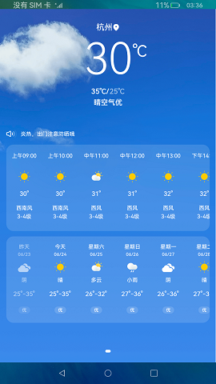
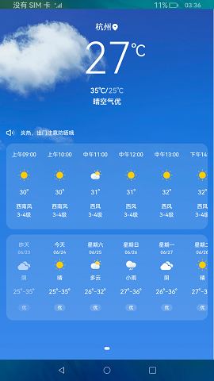

# Ability与ServiceExtensionAbility通信

### 介绍

本示例展示通过[IDL的方式](https://gitee.com/openharmony/docs/blob/master/zh-cn/application-dev/IDL/idl-guidelines.md#ts%E5%BC%80%E5%8F%91%E6%AD%A5%E9%AA%A4) 和 [@ohos.rpc](https://gitee.com/openharmony/docs/blob/master/zh-cn/application-dev/reference/apis-ipc-kit/js-apis-rpc.md) 等接口实现了Ability与ServiceExtensionAbility之间的通信。

### 效果预览

|初始温度|刷新后的温度|
|--------------------------------|--------------------------------|
||

使用说明

1.启动应用后，首页展示城市的天气信息，当前温度每隔5S会刷新一次。

### 工程目录
```
entry/src/main/ets/
|---Application
|---feature
|   |---HomeFeature.ets                  // 任务信息组件
|---MainAbility
|---Mock
|   |---RequestData.ts                   // 远程请求的数据
|   |---WeatherData.ts                   // 天气页面数据
|---model
|   |---FormDate.ts                      // 日期函数方法
|   |---Main.ts                          // 数据类
|---pages
|   |---home
|   |   |---BasicDataSource.ets          // 懒加载封装类
|   |   |---HomeContent.ets              // 内容组件
|   |   |---HoursWeather.ets             // 天气组件(小时)
|   |   |---IndexHeader.ets              // 首页头部组件
|   |   |---MultiDayWeather.ets          // 天气组件(天)
|   |---Home.ets                         // 首页
|---util
|   |---Logger.ts                        // 日志工具
|   |---Style.ts                         // 静态样式变量
```
### 具体实现

* Ability与ServiceExtensionAbility通信的方法主要封装在idl_weather_service_proxy、idl_weather_service_stub、HomeFeature、ServiceExtAbility中，源码参考:[idl_weather_service_proxy.ts](entry/src/main/ets/MainAbility/data/IIdlWeatherServiceTS/idl_weather_service_proxy.ts) ，[idl_weather_service_stub.ts](entry/src/main/ets/MainAbility/data/IIdlWeatherServiceTS/idl_weather_service_stub.ts) ，[HomeFeature](entry/src/main/ets/feature/HomeFeature.ts) ，[ServiceExtAbility](entry/src/main/ets/serviceExtensionAbility/ServiceExtAbility.ts) 。
    * 建立服务器连接：通过HomeFeature中的this.context.connectAbility(want, this.options)方法来建立服务器连接；
    * 接收服务端实例并发送请求：连接成功时new IdlWeatherServiceProxy(proxy)来接收服务端实例，通过[@ohos.rpc](https://gitee.com/openharmony/docs/blob/master/zh-cn/application-dev/reference/apis-ipc-kit/js-apis-rpc.md) 接口来执行new rpc.MessageOption(0)、 new rpc.MessageParcel()、 new rpc.MessageParcel()获取 MessageParcel对象和请求的模式，调用idl_weather_service_proxy中的this.proxy.sendRequest()来发送请求；
    * 接收远程请求处理数据：在idl_weather_service_stub中接收远程请求并通过ServiceExtAbility中的updateWeather()函数来处理数据进行返回；
    * 获取数据：最后将获得的数据渲染到页面中去；
    * 断开连接：可以通过HomeFeature中的this.context.disconnectAbility(this.connection)方法来断开服务器连接，这里的this.connection是建立连接之后的返回值。

### 相关权限

不涉及。

### 依赖

不涉及。

###  约束与限制

1.本示例仅支持标准系统上运行。

2.本示例为stage模型，已适配API version 9版本SDK，版本号：3.2.11.9。

3.本示例需要使用DevEco Studio 3.1 Beta2 (Build Version: 3.1.0.400, built on April 7, 2023)及以上版本才可编译运行。

4.本示例使用了ServiceExtensionAbility相关系统接口，需要替换Full SDK，使用Full SDK时需要手动从镜像站点获取，并在DevEco Studio中替换，具体操作可参考[替换指南](https://gitee.com/openharmony/docs/blob/master/zh-cn/application-dev/faqs/full-sdk-switch-guide.md)。

5.本示例使用了ServiceExtensionAbility，需要在签名证书UnsgnedReleasedProfileTemplate.json中配置"app-privilege-capabilities": ["AllowAppUsePrivilegeExtension"]，否则安装失败。具体操作指南可参考[应用特权配置指南](https://gitee.com/openharmony/docs/blob/master/zh-cn/application-dev/security/AccessToken/permissions-for-system-apps.md)。

### 下载

如需单独下载本工程，执行如下命令：
```
git init
git config core.sparsecheckout true
echo code/SystemFeature/IDL/AbilityConnectServiceExtension/ > .git/info/sparse-checkout
git remote add origin https://gitee.com/openharmony/applications_app_samples.git
git pull origin master

```