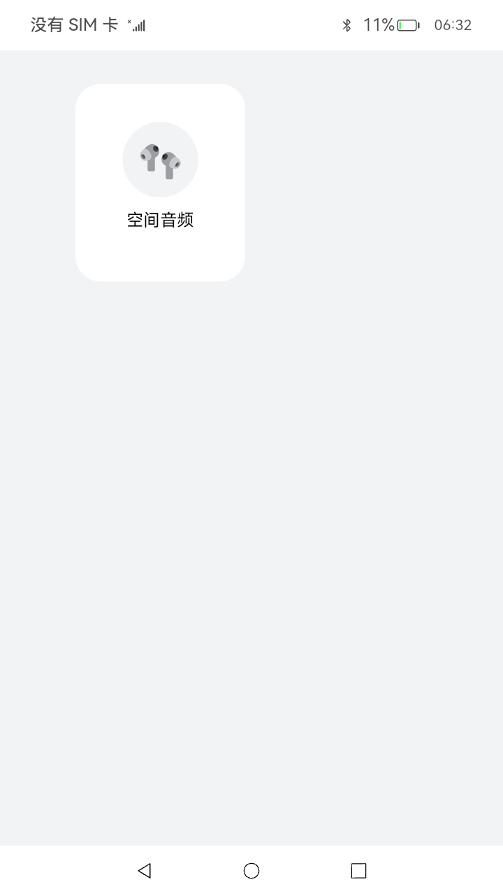
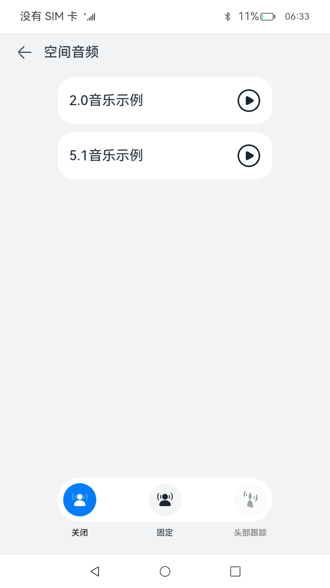
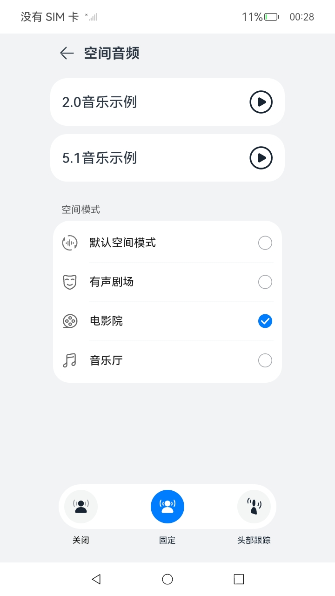

# 音频管理（仅对系统应用开放）

### 介绍

此Sample展示
[空间音频API](https://gitee.com/openharmony/interface_sdk-js/blob/master/api/@ohos.multimedia.audio.d.ts) 的用法，相关API包括:
1. isSpatializationSupported(): 查询系统是否支持空间音频， 
2. isHeadTrackingSupported()：查询系统是否支持头动跟踪，
3. isSpatializationSupportedForDevice(deviceDescriptor: AudioDeviceDescriptor)：查询设备是否支持空间音频，
4. isHeadTrackingSupportedForDevice(deviceDescriptor: AudioDeviceDescriptor)：查询设备是否支持头动跟踪，
5. isSpatializationEnabled()：查询空间音频是否开启，
6. isHeadTrackingEnabled(): 查询头动跟踪是否开启，
7. setSpatializationEnabled(enable: boolean)：设置空间音频开启状态，
8. setHeadTrackingEnabled(enable: boolean)：设置头动跟踪开启状态，

实现效果如下：

### 效果预览
| 主页                                     | 空间音频界面                                  | 空间音频（支持场景化） |
|----------------------------------------|-----------------------------------------|----------------------|
|  |  ||

使用说明

1. 启动应用，在主页卡片中选择空间音频卡片，进入空间音频演示

2. 在上部的两个音乐播放器分别可以播放2.0和5.1的音源，体现了音频框架对多声道播放的支持

3. 下方的空间音频UX，具体的界面会随音频播放的设备而变化：外放及普通耳机只会启用关闭模式；支持空间音频和头动追踪的耳机会使三个按钮全部可选。

4. 点击三个按钮，分别会启用”关闭空间音频“，”启用空间音频固定模式“，”启用空间音频头动追踪模式“

5. 当前版本,音频管家判断耳机支持空间音频会显示三态按钮UX，否则页面只有关闭模式使能。

6. 当空间音频可以使用时，可以通过空间模式卡片选择场景。

### 工程目录

```
entry/src/main/ets/
|---pages
|---|---Index.ets                           //首页
|---|---SpatialAudio.ets                    //空间音频页面
```

### 相关权限

蓝牙使用权限：ohos.permission.USE_BLUETOOTH
音效管理权限：ohos.permission.MANAGE_SYSTEM_AUDIO_EFFECTS

### 具体实现

* 播放立体声多声道音频文件，调用空间音频API查询设置开关状态的内容在[SpatialAudio.ets](entry/src/main/ets/pages/SpatialAudio.ets)
    * 在createAudioRenderer(options: AudioRendererOptions)入参AudioRendererOptions中增加AudioChannelLayout字段指明音频文件声道布局，以辅助多声道音频文件播放
    * 使用isSpatializationSupported(), isHeadTrackingSupported(), isSpatializationSupportedForDevice(AudioDeviceDescriptor), isHeadTrackingSupportedForDevice(AudioDeviceDescriptor)四个接口查询系统和设备是否支持空间音频和头动跟踪，根据查询结果设置用户UX界面状态:只有系统和设备全都支持某功能，其按钮状态才不会被置灰。
    * 使用isSpatializationEnabled(), isHeadTrackingEnabled()在每次UX界面出现时查询当前空间音频和头动跟踪是否开启，同步在其他app对开关状态的改动
    * 使用setSpatializationEnabled(enable: boolean), setHeadTrackingEnabled(enable: boolean)，在点击UX按钮时设置空间音频和头动跟踪状态。
    * 使用setSpatializationSceneType(spatializationSceneType: AudioSpatializationSceneType)，设置空间模式
    * 使用getSpatializationSceneType()，查询当前的空间模式

### 约束与限制

1.本示例仅支持标准系统上运行。

2.本示例为Stage模型，仅支持API12版本SDK。

3.本示例需要使用DevEco Studio 版本号(3.1.1Release)版本才可编译运行。

4.本示例需要使用系统权限的系统接口。使用Full SDK时需要手动从镜像站点获取，并在DevEco Studio中替换，具体操作可参考[替换指南](https://docs.openharmony.cn/pages/v3.2/zh-cn/application-dev/quick-start/full-sdk-switch-guide.md/)。

5.本示例涉及系统接口，需要配置系统应用签名，可以参考[特殊权限配置方法](https://docs.openharmony.cn/pages/v3.2/zh-cn/application-dev/security/hapsigntool-overview.md/) ，把配置文件中的“app-feature”字段信息改为“hos_system_app”，再将“apl”字段信息改为“system_core”。

### 下载

如需单独下载本工程，执行如下命令：

```
git init
git config core.sparsecheckout true
echo code/SystemFeature/Media/Audio/ > .git/info/sparse-checkout
git remote add origin https://gitee.com/openharmony/applications_app_samples.git
git pull origin master
```