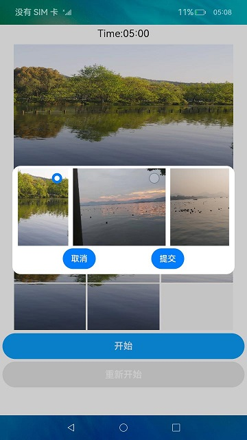

# Puzzle Game

### Introduction

This puzzle game app is developed based on the **\<Grid>** component. It uses the `Image` and `MediaLibrary` APIs to obtain and crop images. Below shows the sample app.

### Concepts

`ImagePacker`: a class that provides APIs to pack images. Before calling any API in `ImagePacker`, you must use `createImagePacker` to create an `ImagePacker` instance.

`MediaLibrary`: a class that provides APIs to access and modify media data such as audios, videos, images, and documents.

### Required Permissions

ohos.permission.READ_MEDIA

### Usage

1. The sample app reads the image files on the local device and displays the first image it obtains. If there is no image on the local device, a blank is displayed.

2. Touch **Start**, and the countdown begins. If you fail to finish the puzzle within the specified time, the game ends. You can touch **Restart** to play the game again.

3. When the game is in progress, you can touch any image around the gray grid to swap the position of the image and highlighted grid cell, until you get a complete image.

4. When the game is not in progress, you can touch the large image on the top and select another image for the game.

### Constraints

1. This sample can only be run on standard-system devices.

2. This sample demonstrates the stage model, which supports only API version 9.

3. This sample requires DevEco Studio 3.1 Canary1 (Build Version: 3.1.0.100) to compile and run.
