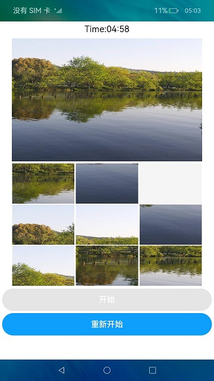
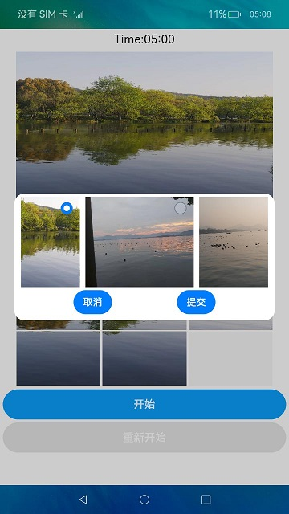

# 拼图

### 介绍

该示例通过[@ohos.multimedia.image](https://gitee.com/openharmony/docs/blob/master/zh-cn/application-dev/reference/apis-image-kit/js-apis-image.md)和[@ohos.file.photoAccessHelper](https://docs.openharmony.cn/pages/v4.1/zh-cn/application-dev/reference/apis-media-library-kit/js-apis-photoAccessHelper.md)接口实现获取图片，以及图片裁剪分割的功能。

### 效果预览
|首页|运行|
|---|---|
|||

使用说明：
1. 使用预置相机拍照后启动应用，应用首页会读取设备内的图片文件并展示获取到的第一个图片，没有图片时图片位置显示空白；
2. 点击Start开始后，时间开始倒计时，在规定时间内未完成拼图则游戏结束。在游戏中，玩家点击Restart进行游戏重置；
3. 点击开始游戏后，玩家可以根据上方的大图，点击灰格周围的图片移动，点击后图片和灰格交换位置,最终拼成完整的图片；
4. 不在游戏中时，玩家可以点击上方大图，选择自定义图片来进行拼图游戏。

### 工程目录
```
VideoComponent/src/main/ets/components
|---common
|   |---ImagePicker.ets                     // 图片选择
|---model
|   |---GameRules.ts                        // 游戏规则
|   |---ImageModel.ts                       // 图片操作
|   |---Logger.ts                           // 日志
|   |---PictureItem.ts                      // 分解的图片
|---pages
|   |---Index.ets                           // 首页
```
### 具体实现

+ 游戏中图片裁剪分割的效果实现在ImageModel中，源码参考[ImageModel](entry/src/main/ets/model/ImageModel.ts):
  + 获取本地图片：首先使用getMediaLibrary获取媒体库实例，然后使用getFileAssets方法获取文件资源，最后使用getAllObject获取检索结果中的所有文件资产方便展示；
  + 裁剪图片准备：裁剪图片需要使用[@ohos.multimedia.image](https://gitee.com/openharmony/docs/blob/master/zh-cn/application-dev/reference/apis-image-kit/js-apis-image.md)接口，裁剪前需要申请图片编辑权限，使用[requestPermissionsFromUser](https://gitee.com/openharmony/docs/blob/master/zh-cn/application-dev/reference/apis-ability-kit/js-apis-abilityAccessCtrl.md#requestpermissionsfromuser9)申请，源码参考[Index.ets](entry/src/main/ets/pages/Index.ets);
  + 图片编辑：首先使用createImagePacker创建ImagePacker实例，然后使用fileAsset.open打开文件，调用createImageSource接口创建图片源实例方便操作图片，接下来使用getImageInfo方法获取图片大小便于分割，最后使用createPixelMap方法传入每一份的尺寸参数完成图片裁剪。

### 相关权限

[ohos.permission.MEDIA_LOCATION](https://gitee.com/openharmony/docs/blob/master/zh-cn/application-dev/security/AccessToken/permissions-for-all.md#ohospermissionmedia_location)

[ohos.permission.READ_IMAGEVIDEO](https://gitee.com/openharmony/docs/blob/master/zh-cn/application-dev/security/AccessToken/permissions-for-system-apps.md#ohospermissionread_imagevideo)

### 依赖

不涉及。

### 约束与限制

1. 本示例仅支持标准系统上运行;
2. 本示例已适配API version 10版本SDK，版本号：4.0.10.18;
3. 本示例需要使用DevEco Studio 3.1 Beta2 (Build Version: 3.1.0.400, built on April 7, 2023)才可编译运行。

### 下载
如需单独下载本工程，执行如下命令：
```
git init
git config core.sparsecheckout true
echo code/BasicFeature/Media/GamePuzzle/ > .git/info/sparse-checkout
git remote add origin https://gitee.com/openharmony/applications_app_samples.git
git pull origin master
```