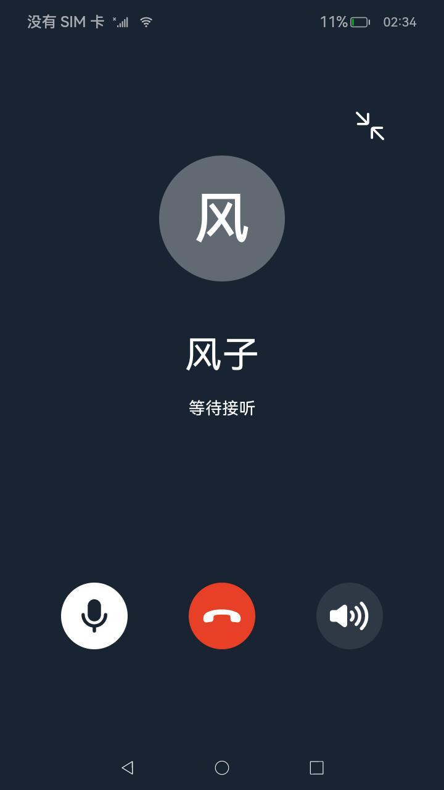
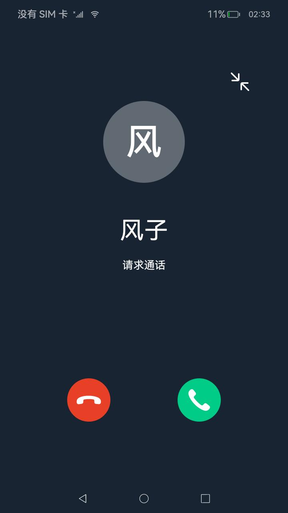
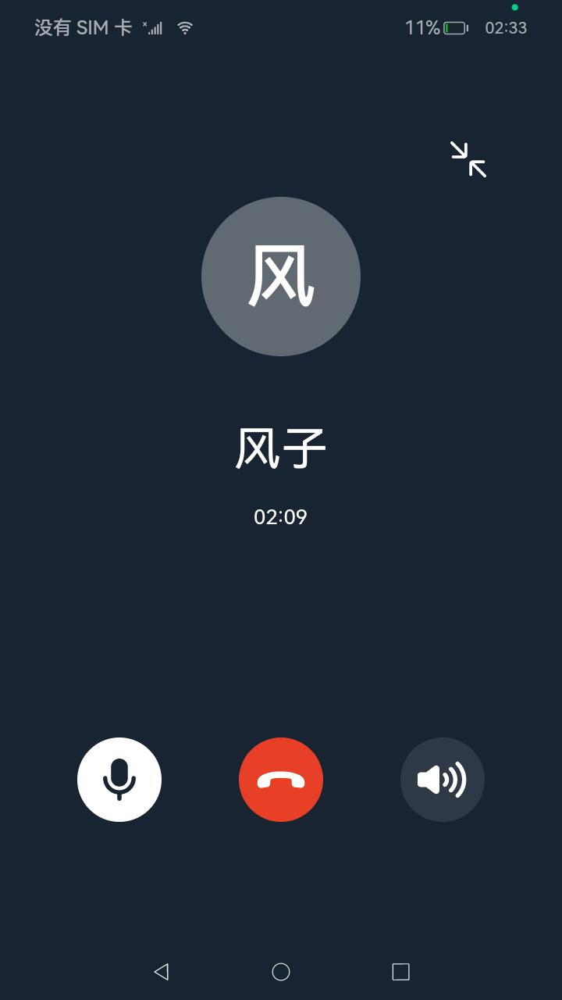
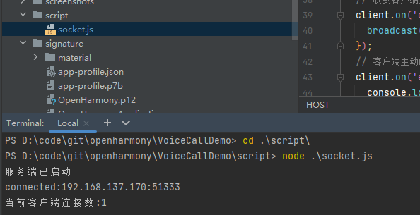
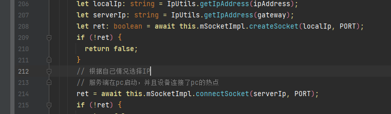
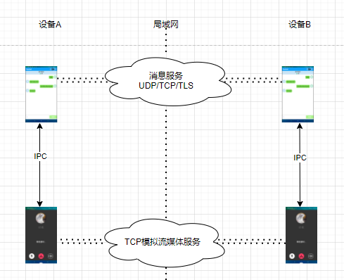

# 音频通话示例

### 介绍

本示例主要展示了音频通话相关的功能，使用[@ohos.multimedia.audio](https://gitee.com/openharmony/docs/blob/master/zh-cn/application-dev/reference/apis-audio-kit/js-apis-audio.md)
、[@ohos.net.socket](https://gitee.com/openharmony/docs/blob/master/zh-cn/application-dev/reference/apis-network-kit/js-apis-socket.md)
等接口，实现音频录制和渲染，音频数据网络传输等功能

### 效果预览

| 发起通话                                       | 来电                                          | 通话页                                      | 悬浮窗                                          |
|--------------------------------------------|---------------------------------------------|------------------------------------------|----------------------------------------------|
|  |  |  |  |

使用说明

1.语音通话需要运行服务端代码模拟启动流媒体服务端，连接成功后服务端会在终端打印client连接数，如下图：



2.服务端和两台设备在局域网内组成socket网络，运行时需要注意修改ip地址：

- 服务端地址在[socket.js](./script/socket.js)第19行修改
- 客户端地址在[BufferModel.ets](./entry/src/main/ets/model/BufferModel.ets)，将serverIp替换为服务端IP地址即可
  



3.仅体验语音通话功能时，可以两台设备都手动启动语音通话应用，分别点击接听按钮进入通话页面

4.体验场景所有功能时，需要两台设备启动[聊天应用](https://gitee.com/openharmony/applications_app_samples/tree/master/code/BasicFeature/Connectivity/StageSocket),通过左下方语音按钮发起语音通话

5.一方发起语音通话请求，对方选择同意或拒绝

6.对方同意后，进行通话

7.通话页或请求通话页可以选择关闭麦克风或扬声器

8.对方拒接或同意后挂断，则返回聊天页面


### 工程目录

```
/VoiceCallDemo
├── entry             # 主entry模块目录
│   └── src
│       ├── main
│           ├── ets                                # ets模块目录
│               ├── audio                          # 音频录制和渲染
│               ├── components                     # 组件目录
│                   ├── ComponentOption.ets        # 按钮组件，如扬声器麦克风切换按钮
│                   ├── ComponentPerson.ets        # 头像和名称组件
│                   ├── ComponentVoiceBg.ets       # 通话公用父组件
│                   ├── UIAnswer.ets               # 被呼叫UI
│                   ├── UICall.ets                 # 呼叫UI
│                   ├── UIVoice.ets                # 呼叫UI或通话UI
│               ├── controller                     # 
│                   ├── FloatWindowController.ets  # 负责管理悬浮窗切换
│                   ├── IndexController.ets        # 负责管理socket连接逻辑，worker启动停止，UI和通话事件传递
│               ├── entryability                
│               ├── model                          #  
│                   ├── AudioManagerModel.ts       # mic开关和扬声器开关
│                   ├── BufferModel.ts             # 流媒体连接，数据接收与发送，管理workers
│                   ├── OptionModel.ets            # 与聊天示例应用通讯事件管理
│               ├── net                            # 网络层封装代码，不含业务逻辑
│               ├── pages                          # 
│               ├── utils                          # 工具类目录
│               ├── workers                        # works目录
│                   ├── CapturerWorker.ts          # 音频录制线程
│                   ├── RendererWorker.ts          # 音频渲染线程
│               ├── Constants.ts                   # 定义 workers 通讯常量，UI事件常量，IPC通讯常量

```

### 具体实现

+ TCP socket模拟音频流网络传输：
    + 代码：[BufferModel](entry/src/main/ets/model/BufferModel.ets)和 [SocketImpl](entry/src/main/ets/net/SocketImpl.ets)
    + 使用@ohos.net.socket 的constructTCPSocketInstance创建TCP socket连接，模拟实现音频流网络传输
    + 3s一次检查网络状态和尝试连接，实现网络异常时的处理逻辑
+ 音频录制：
    + [CapturerWorker](entry/src/main/ets/workers/CapturerWorker.ts)创建音频采集的子线程
    + [AudioCapturerHelper](./entry/src/main/ets/audio/AudioCapturerHelper.ts)
      使用@ohos.multimedia.audio.AudioCapturer完成音频采集 [具体使用参考](https://docs.openharmony.cn/pages/v4.0/zh-cn/application-dev/media/using-audiocapturer-for-recording.md/)
+ 音频播放：
    + [RendererWorker](entry/src/main/ets/workers/RendererWorker.ts)创建音频播放的子线程
    + [AudioRendererHelper](./entry/src/main/ets/audio/AudioCapturerHelper.ts)
      使用@ohos.multimedia.audio.AudioRenderer完成音频播放 [具体使用参考](https://docs.openharmony.cn/pages/v4.0/zh-cn/application-dev/media/using-audiorenderer-for-playback.md/)
+ 麦克风与扬声器以及通话场景控制：
    + 代码[AudioManagerModel](entry/src/main/ets/model/AudioManagerModel.ets)
    + 使用@ohos.multimedia.audio.AudioManager的setAudioScene接口切换通话场景
    + 使用@ohos.multimedia.audio.AudioVolumeGroupManager的setMicrophoneMute接口切换麦克风
    + 使用@ohos.multimedia.audio.AudioRoutingManager的setCommunicationDevice接口切换扬声器

### 相关权限

| [权限](https://docs.openharmony.cn/pages/v3.2/zh-cn/application-dev/security/permission-list.md/) | 说明               | 权限登记         | 授权方式         |
|-------------------------------------------------------------------------------------------------|------------------|--------------|--------------|
| ohos.permission.MICROPHONE                                                                      | 允许应用使用麦克风        | normal       | user_grant   |
| ohos.permission.INTERNET                                                                        | 允许使用Internet网络   | normal       | system_grant |
| ohos.permission.GET_WIFI_INFO                                                                   | 允许应用获取WLAN信息     | normal       | system_grant |
| ohos.permission.MANAGE_AUDIO_CONFIG                                                             | 允许应用进行全局麦克风静音等操作 | system_basic | system_grant |
| ohos.permission.SYSTEM_FLOAT_WINDOW                                                             | 允许应用使用悬浮窗的能力     | system_basic | system_grant |

### 依赖

1. windows上启动node socket服务，模拟流媒体服务，音频数据使用pcm传输，未编解码. [代码](./script/socket.js)
2. 需要使用[聊天示例](https://gitee.com/openharmony/applications_app_samples/tree/master/code/BasicFeature/Connectivity/StageSocket)启动音频通话功能



### 约束与限制

1.本示例仅支持标准系统上运行，支持设备：RK3568,DAYU200。

2.本示例为Stage模型，支持API10版本SDK，SDK版本号(API Version 10 Release),镜像版本号(4.0 Release)

3.本示例需要使用DevEco Studio 版本号(4.0 Release)及以上版本才可编译运行。

4.本示例涉及使用系统接口@ohos.multimedia.audio：setAudioScene，需要手动替换Full
  SDK才能编译通过，具体操作可参考[替换指南](https://gitee.com/openharmony/docs/blob/master/zh-cn/application-dev/faqs/full-sdk-switch-guide.md)

5.本示例所配置的权限为system_basic级别(
  相关权限级别可通过[权限定义列表](https://gitee.com/openharmony/docs/blob/master/zh-cn/application-dev/security/AccessToken/permissions-for-system-apps.md)
  查看),需要手动配置对应级别的权限签名(
  具体操作可查看[自动化签名方案](https://gitee.com/openharmony/docs/blob/master/zh-cn/application-dev/security/hapsigntool-overview.md))

6.本示例有使用系统特性api，需要手动配置对应级别的应用类型("app-feature": "hos_system_app")。具体可参考profile配置文件[bundle-info对象内部结构](https://gitee.com/openharmony/docs/blob/master/zh-cn/application-dev/security/app-provision-structure.md#bundle-info%E5%AF%B9%E8%B1%A1%E5%86%85%E9%83%A8%E7%BB%93%E6%9E%84)

### 下载

如需单独下载本工程，执行如下命令：

```
git init
git config core.sparsecheckout true
echo code\SystemFeature\Media\VoiceCallDemo\ > .git/info/sparse-checkout
git remote add origin https：//gitee.com/openharmony/applications_app_samples.git
git pull origin master
```